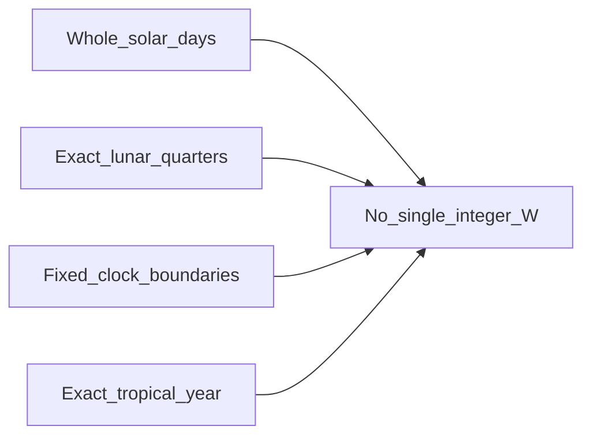

# Impossibility and remainder

## The core theorem (informal)

**Nature’s dominant periods are incommensurable with each other and with small integers.**

If you require simultaneously:

- weeks of **whole mean solar days**,
- exact long-term alignment with **synodic months**,
- exact long-term alignment with the **tropical year**,
- **fixed clock-time** week boundaries (circadian lock),

then **no** single integer week length \(W\) satisfies all four. Something must give: drift, intercalation, mixed-length weeks, non-integer phase weeks, or abandoning one target.

This is not a failure of imagination. It is **bad luck in number theory** applied to real periods.

More diagrams: [06-visual/cycle-map.md](../06-visual/cycle-map.md).

## Why quarters do not save you

The synodic month divides into four **equal mean quarters** at 7.382647… days each. That division is exact in ratio space:

\[
\frac{29.530588861}{4} = 7.38264721525\ \text{d}
\]

But **7.382647… is not an integer**. So a “natural lunar week” is either:

- **faithful but non-integer** (boundary drifts through clock time), or
- **integer but approximate** (7 or 8 days, or a mix).

There is no third option that is both integer and exact.

## Competing requirements as a matrix

| Requirement | Favors | Conflicts with |
|-------------|--------|----------------|
| Lunar phase alignment | W ≈ 7.38, or 4×W ≈ month | Integer W = 7 or 8 only |
| Spring–neap rhythm | W ≈ 7.38 or 14.77 / k | Same |
| Clean year factorization | W divides 365 (e.g. 5) | Lunar fit |
| Binary scheduling | W = 2ⁿ (8, 16) | Lunar quarter |
| Small divisor count | W prime (7) | Composite scheduling |
| No intercalation | Accept drift | Long-run seasons & phases |

## Residuals you cannot zero out

Example with \(W = 7\):

- Synodic month / 7 = 4.2187… → **0.2187 month error** per 7-day “month slice,” or about **1.53 days** per lunar month if you force four weeks = one month.
- Four weeks = 28 days vs synodic 29.53 → **~1.53 d short** every month.

Example with \(W = 8\):

- 29.53 / 8 = 3.691… weeks per month - lunar quarter fit is **worse** than 7, but binary splits are **better**.

Example with \(W = 5\):

- 365.242 / 5 = 73.048… weeks per year - **excellent year fit**, weak lunar fit.

Each choice exports error to **intercalation** (leap days, leap weeks, leap months) or to **accepted drift**.

## Epact as the design object

In Gregorian reckoning, *epact* is the age of the Moon on 1 January - bookkeeping for lunar–solar mismatch.

In this project, **Epact** names the general idea: **the remainder when two natural cycles are forced into a common grid.**

Design work is honest when it:

1. States which remainder is carried where (day, week, month, year).
2. States how often correction fires (Metonic-scale, century-scale, or never).

## What remains possible

- **No fixed integer W** closes one synodic month with four equal weeks.
- **Two-valued** 7/8 weeks close a **59 d ≈ 2-lunation** pair and, at Metonic scale, an **integer 6940-day grid** (940 weeks, 235 admin months) that **approximates** 19 tropical years and 235 mean synodic months - not exact day equality ([metonic-week-grid.md](../03-search/metonic-week-grid.md)).
- **Single-W** integers remain compromises on [Score_int](../03-search/integer-weeks.md).
- **Dual overlays** - civil integer week + phase calendar that does not nest.

The impossibility theorem is **narrower** than “nothing nests”: fixed **one** W fails; period-2 **7/8** succeeds at month pair and Metonic periods.

See [scoring.md](scoring.md) for quantified tradeoffs and [cycle-map.md](../06-visual/cycle-map.md) for diagrams and [03-search/intercalation.md](../03-search/intercalation.md) for where remainders go.
