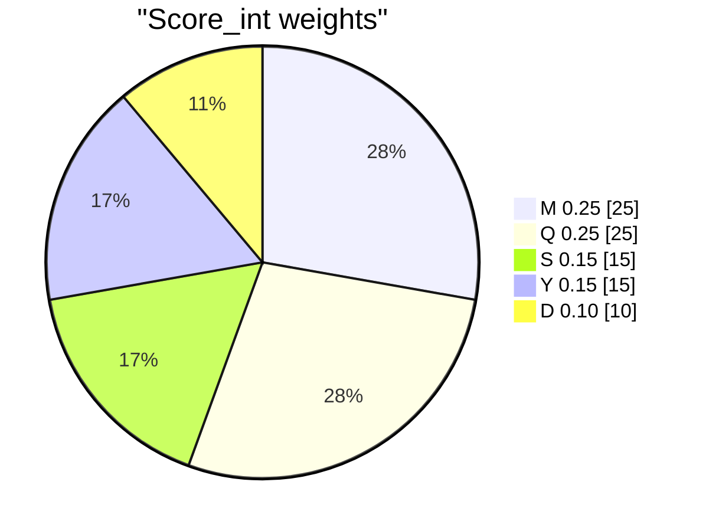

# Scoring

Every search table in `03-search/` uses this definition unless noted.

## Integer week length \(W\) (days)

### Helper: distance to nearest integer

For ratio \(R/W\):

\[
f(R, W) = \left| \frac{R}{W} - \mathrm{round}\left(\frac{R}{W}\right) \right|
\]

Moon alignment score:

\[
M(W) = 1 - f(29.530588861,\ W)
\]

Spring–neap score:

\[
S(W) = 1 - f(14.765294430,\ W)
\]

Year score:

\[
Y(W) = 1 - f(365.242190402,\ W)
\]

**Common mistake:** using the fractional part of \(R/W\) instead of \(f(R,W)\). Example: \(365.242/6 = 60.874\) → \(f = 0.126\) → **Y = 0.874**, not 0.126.

### Lunar quarter proximity

\[
Q_{\mathrm{prox}}(W) = \max\left(0,\ 1 - \frac{|W - Q|}{Q}\right), \quad Q = 7.382647215
\]

### Divisibility

\[
D_{\mathrm{norm}}(W) = \min\left(\frac{\tau(W) + \mathbb{1}_{2|W}\cdot 0.5 + \mathbb{1}_{3|W}\cdot 0.5}{6},\ 1\right)
\]

### Day-error (lunation closure)

If each “month” packs \(\mathrm{round}(29.530589/W)\) weeks:

\[
E_{\mathrm{moon}}(W) = \left| 29.530588861 - \mathrm{round}\left(\frac{29.530588861}{W}\right) \cdot W \right| \quad \text{(days)}
\]

Ratio scores \(M(W)\) and \(E_{\mathrm{moon}}\) can disagree (e.g. W=1 vs W=30); publish both.

### Circadian lock (not in integer rank)

\[
C(W) = \begin{cases} 1 & W \in \mathbb{Z}^+ \text{ on mean solar days} \\ 0 & \text{phase week } \approx 7.382647\ \text{d} \end{cases}
\]

\(C=1\) for **all** integer rows - adding \(0.10\,C\) to the composite is a **constant offset** and does not change order. Use \(C\) only when comparing integer weeks to phase-faithful weeks.

### Composite scores

**Score_int** (default integer leaderboard):

\[
\mathrm{Score\_int}(W) = 0.25\,M + 0.25\,Q_{\mathrm{prox}} + 0.15\,S + 0.15\,Y + 0.10\,D_{\mathrm{norm}}
\]

**Lunar bundle** (reduces M vs Q double-count):

\[
L(W) = 0.5\,M + 0.5\,Q_{\mathrm{prox}}
\]

**Score_ref** (refactored default; encodes “week tracks Moon” - see [axioms.md](axioms.md)):

\[
\mathrm{Score\_ref}(W) = 0.40\,L + 0.10\,S + 0.25\,Y + 0.25\,D_{\mathrm{norm}}
\]

**Legacy** (includes circadian constant):

\[
\mathrm{Score\_legacy}(W) = \mathrm{Score\_int}(W) + 0.10
\]

Parameter sweeps: [weight-sensitivity.md](../03-search/weight-sensitivity.md).

**Rest density** and **intercalation frequency** are not in these scores; they live in `04-systems/`.

## Worked examples (Score_int)

Constants: synodic = 29.530589, spring–neap = 14.765294, tropical year = 365.242190.

### \(W = 6\)

| Term | Calculation | Value |
|------|-------------|-------|
| \(M\) | \(f(29.530589/6)=0.078\) | 0.922 |
| \(Q_{\mathrm{prox}}\) | \(\|6-7.383\|/7.383\) | 0.813 |
| \(S\) | \(f(14.765/6)=0.461\) | 0.539 |
| \(Y\) | \(f(365.242/6)=0.126\) | **0.874** |
| \(D_{\mathrm{norm}}\) | \(5/6\) | 0.833 |
| **Score_int** | weighted sum | **0.729** |

### \(W = 7\)

| Term | Calculation | Value |
|------|-------------|-------|
| \(M\) | \(f(29.530589/7)=0.219\) | 0.781 |
| \(Q_{\mathrm{prox}}\) | | **0.948** |
| \(S\) | \(f(14.765/7)=0.109\) | 0.891 |
| \(Y\) | \(f(365.242/7)=0.177\) | 0.823 |
| \(D_{\mathrm{norm}}\) | \(2/6\) | 0.333 |
| **Score_int** | | **0.723** |

### \(W = 8\)

| Term | Calculation | Value |
|------|-------------|-------|
| \(M\) | \(f(29.530589/8)=0.309\) | **0.691** |
| \(Q_{\mathrm{prox}}\) | | 0.916 |
| \(S\) | \(f(14.765/8)=0.154\) | **0.846** |
| \(Y\) | \(f(365.242/8)=0.345\) | **0.655** |
| \(D_{\mathrm{norm}}\) | \(4.5/6\) | 0.750 |
| **Score_int** | | **0.702** |

**Reading:** Under **Score_int** (weights above), **W=6** obtains the highest score among tested integers W=1…30 (0.729), then **7** (0.723), then **5** (0.715). **7** has the highest **Q_prox** and **S**; **6** has the highest **Y** among {6,7,8}. Rankings swap if weights change - not a unique “correct” week.

## Non-integer reference week

Phase quarter \(W_\phi = 7.382647\) d: \(Q_{\mathrm{prox}}=1\), \(C=0\) for clock-time lock.

## Mixed 7/8 blocks

Mean week \(\bar{W} = (7a+8b)/(a+b)\); score \(\bar{W}\) with formulas above per sub-week. See [mixed-weeks.md](../03-search/mixed-weeks.md) and [metonic-week-grid.md](../03-search/metonic-week-grid.md).
