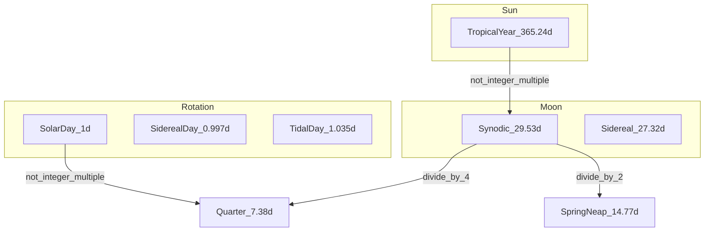

# Natural cycles catalog

This file lists **measurable** cycles that could anchor a time system. Values are mean periods in **mean solar days** unless noted. See [constants.md](../00-method/constants.md).

## Earth rotation

| Cycle | Period | Use as “day”? |
|-------|--------|----------------|
| Mean solar day | 1.000 d | Default civil day (86400 s). |
| True solar day | varies ±~30 s eq. | Sundial day; uneven. |
| Sidereal day | 0.99727 d | Star-fixed; 366.26… per tropical year. |
| Lunar (tidal) day | 1.03505 d | Two high waters per ~24 h 50 min at many coasts. |

**Polar edge case:** At high latitude, “day” as daylight duration collapses seasonally. Any design that equates **day = daylight** fails globally without duplication (clock day vs light day).

## Moon - five months, one family

The Moon is not one period. It is several, all near ~27–30 days:

| Type | Period (d) | What repeats |
|------|------------|--------------|
| Synodic | 29.530589 | Phases (new → new). |
| Sidereal | 27.321662 | Position vs stars. |
| Tropical | 27.321582 | Position vs vernal point. |
| Anomalistic | 27.554550 | Perigee → perigee (distance). |
| Draconic | 27.212221 | Ascending node → node (eclipse plane). |

**Week-relevant derived intervals:**

- **Quarter phase:** synodic / 4 = **7.382647 d** (exact in mean ratio).
- **Half month (spring–neap):** synodic / 2 = **14.765294 d**.
- **Fortnight:** colloquially the same half-month; tidal springs every ~14.77 d.

Phase quarters (new, first quarter, full, third quarter) are **even splits of synodic time**, not of sidereal time.

## Tides

Tides are a **superposition** of astronomical sine waves (constituents). Locally, the dominant beat sets coastal “felt” rhythm.

| Phenomenon | Mean interval | Link to week search |
|------------|---------------|---------------------|
| M₂ (principal lunar semi-diurnal) | 12.4206 h | Two highs per lunar day. |
| S₂ (principal solar) | 12.0000 h | Solar semi-diurnal. |
| Spring–neap envelope | 14.765 d | **Same as half synodic month.** |
| Declination (tropic) half-cycle | 13.661 d | Diurnal/mixed regimes; “pseudo” springs. |
| Perigee–apogee (anomalistic) | 27.555 d | Range modulation; not the same as phase. |

**Implication:** A “tidal week” aligned with **phase** is ~7.38 d. A “tidal week” aligned with **declination** is ~13.66 d (half of tropical month). Coast type (semi-diurnal vs diurnal) changes which dominates.

Some tide-dominated sediment records show neap–spring cycles locked to **synodic** or, in other basins, to **tropical** month - geography matters.

## Sun and year

| Cycle | Period (d) | Notes |
|-------|------------|--------|
| Tropical year | 365.242190 | Seasons on average; equinox precession included in definition. |
| Sidereal year | 365.256363 | Star-fixed orbit. |
| Anomalistic year | ~365.26 | Perihelion to perihelion (~365.2596 d). |

## Seasons

Seasons come from **obliquity** (axial tilt ~23.44°) and **elliptical orbit** (Kepler).

- Four seasons are **logical** (solstices and equinoxes) but **not equal length** in days: northern spring/summer are slightly longer than fall/winter in the current orbital configuration.
- A “season = year/4” grid is **mean** convenience, not astronomical equality.

## Longer beats (context only)

| Cycle | Period | Calendar relevance |
|-------|--------|-------------------|
| Metonic | 19 y ≈ 235 lunations | Best famous month–year rational fit. |
| Saros | ~223 synodic months ≈ 18 y | Eclipses; not week structure. |
| Lunar node (nutation) | 18.61 y | Tidal range modulation. |

## Cycle graph (does not nest)

No single integer week length sits at the intersection of all nodes. That is the empirical starting point for Epact.

**Diagrams:** [06-visual/cycle-map.md](../06-visual/cycle-map.md)
