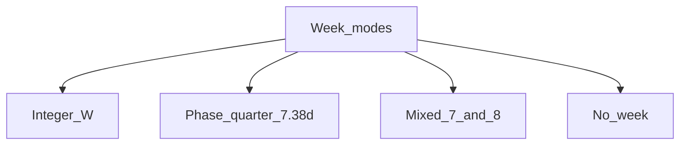

# Unit: week

A **week** is a repeating bundle of days **shorter than a month**, used for short-horizon coordination.

## Four week modes

### 1. Integer week (\(W \in \mathbb{Z}^+\))

- Boundaries on calendar dates; **circadian lock = 1**.
- Approximates lunar quarter (7 or 8) or year (5) or binary tree (8).

### 2. Phase week (non-integer)

- \(W_\phi = 29.530589 / 4 = 7.382647\) d.
- Boundaries tied to **elongation** (new, first quarter, full, third quarter).
- **Circadian lock = 0** if boundary time is astronomical instant, not midnight.

### 3. Mixed integer week (Beatty-style)

- Alternate blocks of 7 and 8 days so mean \(\bar{W} \to 7.382647\).
- Each block keeps circadian lock; **month-level** error shrinks vs pure 7 or 8.

### 4. No week

- Only day, month, year (+ rest rule on day index).
- Week-sized coordination uses **month fractions** or **plain ordinals**.

Historically, cultures also used integer **5, 8, 10**, overlapping counts, or **no single named week** - not because nature issued one number, but because they prioritized year, market, rest, or ritual differently. See [why-seven.md](../05-synthesis/why-seven.md).

## Overlays (Dual system)

Two calendars simultaneously:

- **Civil:** integer \(W=7\) (appointments).
- **Phase:** quarters and months (tides, rituals, ecology).

They **do not nest**. Intersections are labeled, not forced equal.

## Naming days inside a week

| Scheme | Example |
|--------|---------|
| Ordinal | Day 1 … Day W |
| Binary split | For W=8: bits for half-week |
| Phase | New, Wax, Full, Wane (4 names, not 7) |

Epact avoids Monday–Sunday naming.

## Search outputs

- Integer scores: [integer-weeks.md](../03-search/integer-weeks.md)
- Mixed 7/8: [mixed-weeks.md](../03-search/mixed-weeks.md)
- Formulas: [scoring.md](../00-method/scoring.md)
