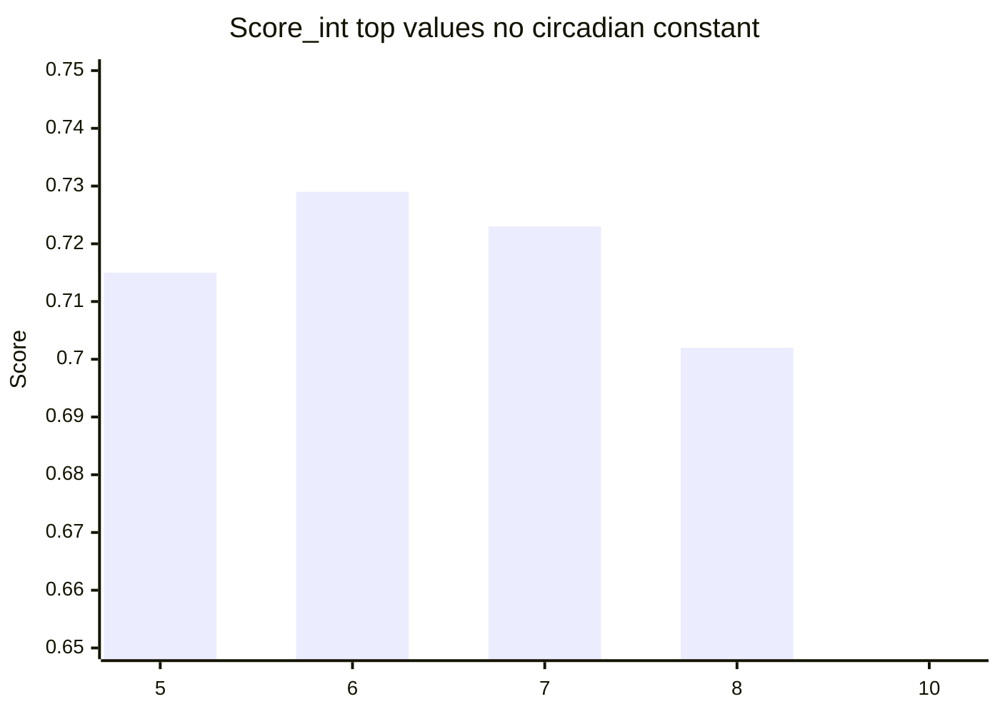

# Integer week search (W = 1 … 30)

Constants: synodic 29.530589 d, quarter 7.382647 d, spring–neap 14.765294 d, tropical year 365.242190 d. Formulas: [scoring.md](../00-method/scoring.md).

**Charts:** [week-composite-scores.md](../06-visual/week-composite-scores.md) · [score-heatmap.md](../06-visual/score-heatmap.md) · [weight-sensitivity.md](weight-sensitivity.md)

**Circadian lock:** all integer rows use whole solar days (see scoring.md; not folded into rank).

## Full table

| W | M | Q_prox | S | Y | D_norm | E_moon (d) | **Score_int** | **Score_ref** |
|---|-----|--------|-----|-----|--------|------------|---------------|---------------|
| 1 | 0.531 | 0.135 | 0.765 | 0.758 | 0.167 | 0.469 | 0.412 | 0.441 |
| 2 | 0.765 | 0.271 | 0.617 | 0.621 | 0.417 | 0.469 | 0.486 | 0.528 |
| 3 | 0.844 | 0.406 | 0.922 | 0.747 | 0.417 | 0.469 | 0.605 | 0.633 |
| 4 | 0.617 | 0.542 | 0.691 | 0.689 | 0.583 | 1.531 | 0.555 | 0.619 |
| 5 | 0.906 | 0.677 | 0.953 | 0.952 | 0.333 | 0.469 | 0.715 | 0.733 |
| 6 | 0.922 | 0.813 | 0.539 | **0.874** | 0.833 | 0.469 | **0.729** | **0.828** |
| 7 | 0.781 | **0.948** | 0.891 | 0.823 | 0.333 | 1.531 | 0.723 | 0.724 |
| 8 | 0.691 | 0.916 | 0.846 | 0.655 | 0.750 | 2.469 | 0.702 | 0.757 |
| 9 | 0.719 | 0.781 | 0.641 | 0.582 | 0.583 | 2.531 | 0.617 | 0.655 |
| 10 | 0.953 | 0.645 | 0.523 | 0.524 | 0.750 | 0.469 | 0.632 | 0.691 |
| 11 | 0.685 | 0.510 | 0.658 | 0.796 | 0.333 | 3.469 | 0.550 | 0.587 |
| 12 | 0.539 | 0.375 | 0.770 | 0.563 | 1.000 | 5.531 | 0.528 | 0.650 |
| 13 | 0.728 | 0.239 | 0.864 | 0.904 | 0.333 | 3.531 | 0.541 | 0.589 |
| 14 | 0.891 | 0.104 | 0.945 | 0.911 | 0.750 | 1.531 | 0.602 | 0.709 |
| 15 | 0.969 | 0.000 | 0.984 | 0.651 | 0.750 | 0.469 | 0.562 | 0.642 |
| 16 | 0.846 | 0.000 | 0.923 | 0.828 | 0.917 | 2.469 | 0.566 | 0.697 |
| 17 | 0.737 | 0.000 | 0.869 | 0.515 | 0.333 | 4.469 | 0.425 | 0.446 |
| 18 | 0.641 | 0.000 | 0.820 | 0.709 | 1.000 | 6.469 | 0.490 | 0.637 |
| 19 | 0.554 | 0.000 | 0.777 | 0.777 | 0.333 | 8.469 | 0.405 | 0.466 |
| 20 | 0.523 | 0.000 | 0.738 | 0.738 | 1.000 | 9.531 | 0.452 | 0.613 |
| 21 | 0.594 | 0.000 | 0.703 | 0.608 | 0.750 | 8.531 | 0.420 | 0.528 |
| 22 | 0.658 | 0.000 | 0.671 | 0.602 | 0.750 | 7.531 | 0.430 | 0.537 |
| 23 | 0.716 | 0.000 | 0.642 | 0.880 | 0.333 | 6.531 | 0.441 | 0.511 |
| 24 | 0.770 | 0.000 | 0.615 | 0.782 | 1.000 | 5.531 | 0.502 | 0.661 |
| 25 | 0.819 | 0.000 | 0.591 | 0.610 | 0.500 | 4.531 | 0.435 | 0.500 |
| 26 | 0.864 | 0.000 | 0.568 | 0.952 | 0.750 | 3.531 | 0.519 | 0.655 |
| 27 | 0.906 | 0.000 | 0.547 | 0.527 | 0.750 | 2.531 | 0.463 | 0.555 |
| 28 | 0.945 | 0.000 | 0.527 | 0.956 | 1.000 | 1.531 | 0.559 | 0.731 |
| 29 | 0.982 | 0.000 | 0.509 | 0.595 | 0.333 | 0.531 | 0.444 | 0.479 |
| 30 | 0.984 | 0.000 | 0.508 | 0.825 | 1.000 | 0.469 | 0.546 | 0.704 |

- **Score_int** - default integer rank: \(0.25M + 0.25Q + 0.15S + 0.15Y + 0.10D_{\mathrm{norm}}\) (no flat +0.10 for circadian).
- **Score_ref** - refactored weights: \(0.40L + 0.10S + 0.25Y + 0.25D_{\mathrm{norm}}\) with \(L = 0.5M + 0.5Q_{\mathrm{prox}}\).
- **E_moon** - day closure error: \(|29.530589 - \mathrm{round}(29.530589/W)\cdot W|\) per lunation if one week count is forced.

### Legacy weights (includes +0.10 circadian constant)

Adding \(0.10\,C(W)\) with \(C=1\) for every integer **does not change rank**; it only shifts all scores up. W=6 legacy **0.829**, W=7 **0.823**, W=5 **0.815**.

## Leaders (Score_int)

Under **Score_int** ([scoring.md](../00-method/scoring.md) weights), **W=6** has the highest score among W=1…30 in this table:

| Rank | W | Score_int | Strength | Weakness |
|------|---|-----------|----------|----------|
| 1 | **6** | 0.729 | Strong M, Q, Y, D | Weak spring–neap (S=0.539) |
| 2 | **7** | 0.723 | Best Q_prox; strong S | Prime week; E_moon 1.53 d if 4×7 month |
| 3 | **5** | 0.715 | Best Y among small W | Weak quarter; 4×5 month far short |
| 4 | **8** | 0.702 | D_norm; Q_prox | E_moon 2.47 d; M lower |

**6 leads 7 by 0.006** on Score_int - within noise of hand-tuned weights; see [weight-sensitivity.md](weight-sensitivity.md).

## Year fit (days, not only Y term)

| W | Weeks/yr (round) | Days/yr | Δ vs 365.242 d |
|---|------------------|---------|----------------|
| 6 | 61 | 366 | +0.758 |
| 7 | 52 | 364 | −1.242 |
| 5 | 73 | 365 | −0.242 |

W=6 is **closer in Y score** than W=7 (0.874 vs 0.823); epact is a **leap day roughly every 1.3 years**, not “ignore the year.”

## Residuals: four equal weeks = one month

| W | 4W (d) | Δ vs synodic (d) |
|---|--------|------------------|
| 6 | 24 | −5.531 |
| 7 | 28 | −1.531 |
| 8 | 32 | +2.469 |
| 5 | 20 | −9.531 |

For integer months without a single W, see [metonic-week-grid.md](metonic-week-grid.md) (7/8 mix, 29/30 d months).

## Reading

- **Quarter story:** 7, then 8, then 6 on Q_prox alone.
- **Year story:** 5, then 6, then 7 among small W.
- **Joint 7/8 grid:** [metonic-week-grid.md](metonic-week-grid.md).
