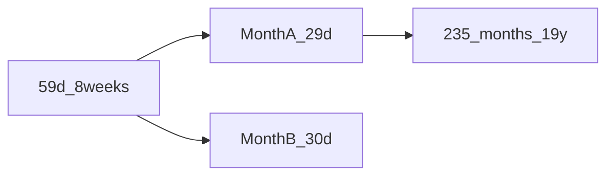

# Metonic week grid (7/8 mix)

A **fixed integer week length** cannot close one synodic month with four equal weeks ([impossibility.md](../00-method/impossibility.md)). A **two-valued** week (7 and 8 days) can close **two months**, then **235 months**, then **19 tropical years**, with whole days throughout.

## 59 days ≈ two synodic months

\[
2 \times 29.530588861 = 59.061177722\ \text{d}
\]

One **59-day / 8-week** block (5×7 + 3×8 d) differs by **≈ 1.47 h** from two mean lunations - not a “wrong scale” cycle.

Split the block into **two months**, each **four weeks**:

| Month | Weeks | Pattern (d) | Total |
|-------|-------|-------------|-------|
| A | W1–W4 | 7 + 7 + 8 + 7 | **29** |
| B | W5–W8 | 7 + 8 + 7 + 8 | **30** |

Pair residual vs 2× synodic:

\[
29 + 30 = 59\ \text{d}, \quad 59.061 - 59 = 0.061\ \text{d} \approx 1.47\ \text{h per 2 months}
\]

vs forcing **7+7+7+8 = 29 d** every month alone: **−0.531 d/month** (~12.7 h) and an epact day every ~1.9 months in naive Mix.

## 19-year closure (Metonic)

Standard Metonic: **19 tropical years ≈ 235 synodic months**.

Extend the 29/30 alternation across 235 months:

- **110 months × 29 d** + **125 months × 30 d** = **6940 d**
- Each month = **4 weeks** (only 7- and 8-day weeks)
- **940 weeks** = **580×7 d** + **360×8 d** = **6940 d**

Check:

| Target | Value (d) | Residual vs 6940 d |
|--------|-----------|---------------------|
| 235 × 29.530589 | 6939.468 | +0.532 d (+12.8 h) / 235 mo |
| 19 × 365.242190 | 6939.602 | +0.398 d (+9.6 h) / 19 y |

Lunar and solar residuals are **hours per 19 years**, not days per month. Optional: **one omitted/intercalary day every ~76 years** holds the solar side under ~0.6 d/century.

## Properties

- Whole **mean solar days** only; weeks are 7 or 8 days.
- **Every month** has exactly **four weeks** (no orphan epact day inside the 235-month core).
- **No fixed integer W**; period-2 month pattern (29/30) carries the epact.

This is the strongest **integer-day lunisolar week** construction in Epact; system write-up: [mix.md](../04-systems/mix.md).

## Comparison to single-W month

| Approach | Typical month error |
|----------|---------------------|
| 4×7 d | −1.531 d |
| 7+7+7+8 every month | −0.531 d (+ epact day often) |
| 29/30 pair in 59 d block | −0.061 d per **two** months |

See [mixed-weeks.md](mixed-weeks.md) for convergents and block layout.
