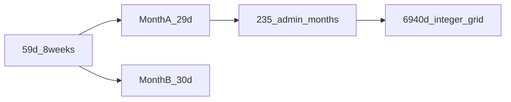

# Metonic week grid (7/8 mix)

A **fixed integer week length** cannot close one synodic month with four equal weeks ([impossibility.md](../00-method/impossibility.md)). The strongest **integer-day** result here is the **59-day / two-month block** (below). Extending that pattern yields a **6940-day civil grid** that **approximates** the classical Metonic interval - it is **not** exact astronomical closure.

> [!NOTE]
> **What this is:** whole-day **7/8** weeks through **235 administrative months** (29/30 d), total **940 weeks = 6940 d**.
>
> **What this is not:** `235 mean synodic months = 6940 d` or `19 tropical years = 6940 d`. Means are ≈ **6939.5 d** ([constants.md](../00-method/constants.md)). The **580 / 360** split of 7- vs 8-day weeks is **forced** once you fix **940 weeks** and **6940 days** (since \(6580 + n = 6940 \Rightarrow n = 360\) eight-day weeks); astronomy does not uniquely demand those counts.

## 59 days ≈ two synodic months

\[
2 \times 29.530588861 = 59.061177722\ \text{d}
\]

One **59-day / 8-week** block (5×7 + 3×8 d) differs by **≈ 1.47 h** from two mean lunations - not a “wrong scale” cycle.

Split the block into **two months**, each **four weeks**:

| Month | Weeks | Pattern (d) | Total |
|-------|-------|-------------|-------|
| A | W1–W4 | 7 + 7 + 8 + 7 | **29** |
| B | W5–W8 | 7 + 8 + 7 + 8 | **30** |

Pair residual vs 2× synodic:

\[
29 + 30 = 59\ \text{d}, \quad 59.061 - 59 = 0.061\ \text{d} \approx 1.47\ \text{h per 2 months}
\]

vs forcing **7+7+7+8 = 29 d** every month alone: **−0.531 d/month** (~12.7 h) and an epact day every ~1.9 months in naive Mix.

## 19-year scale: integer grid vs astronomical means

**Classical Metonic ratio:** 19 tropical years ≈ 235 mean synodic months (lunisolar alignment). In **day count** with Epact constants:

| Quantity | Day count (d) |
|----------|---------------|
| 235 × 29.530588861 | **6939.468** |
| 19 × 365.242190402 | **6939.602** |
| Difference | **0.133 d ≈ 3.2 h** |

That **~3.2 h** is how closely the two **mean** targets match each other - not the residual of the integer grid.

**Integer civil construction:** repeat 29/30 admin months for **235 months**:

- **110 × 29 d** + **125 × 30 d** = **6940 d**
- Each admin month = **4 weeks** (only 7- and 8-day weeks) → **940 weeks**
- **580×7 d** + **360×8 d** = **6940 d**

Residuals of **6940 d** vs astronomy:

| Target | Value (d) | Residual vs 6940 d |
|--------|-----------|---------------------|
| 235 × 29.530589 | 6939.468 | +0.532 d (+12.8 h) / 235 mo |
| 19 × 365.242190 | 6939.602 | +0.398 d (+9.6 h) / 19 y |

Lunar and solar residuals are **hours per 19 years**, not days per month. Optional: **one omitted/intercalary day every ~76 years** holds the solar side under ~0.6 d/century.

## Properties

- Whole **mean solar days** only; weeks are 7 or 8 days.
- **Every admin month** has exactly **four weeks** (no orphan epact day inside the 235-month core).
- **No fixed integer W**; period-2 month pattern (29/30) carries the epact.

This is the strongest **integer-day lunisolar week** construction in Epact under stated constraints; system write-up: [mix.md](../04-systems/mix.md).

## Comparison to single-W month

| Approach | Typical month error |
|----------|---------------------|
| 4×7 d | −1.531 d |
| 7+7+7+8 every month | −0.531 d (+ epact day often) |
| 29/30 pair in 59 d block | −0.061 d per **two** months |

See [mixed-weeks.md](mixed-weeks.md) for convergents and block layout.
