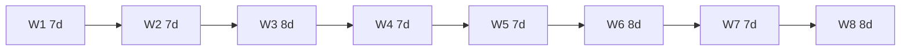

# Mixed 7-day and 8-day weeks

Target mean week length:

\[
Q = \frac{29.530588861}{4} = 7.382647215\ \text{d}
\]

Integer weeks **7** and **8** straddle \(Q\). A **Beatty-style mix** uses \(a\) seven-day weeks and \(b\) eight-day weeks per block:

\[
\bar{W} = \frac{7a + 8b}{a+b}
\]

## Continued fraction convergents of \(Q\)

Expand \(Q = 7.382647…\):

\[
Q = 7 + \frac{1}{2 + \frac{1}{1 + \frac{1}{2 + \cdots}}}
\]

Convergents \(p_k/q_k\) approximate \(Q\) as rationals. Interpret \(q_k\) as **number of weeks** and \(p_k\) as **total days** in a repeating block:

| Block | Weeks (a+b) | Days (7a+8b) | Composition | Mean W (d) | Error vs Q (d) |
|-------|-------------|--------------|-------------|------------|----------------|
| 22/3 | 3 | 22 | 2×7 + 1×8 | 7.333333 | −0.049314 |
| 37/5 | 5 | 37 | 3×7 + 2×8 | 7.400000 | +0.017353 |
| 59/8 | 8 | 59 | 5×7 + 3×8 | 7.375000 | −0.007647 |

The **59-day / 8-week** pattern is the best low-complexity mean among these three.

Timeline detail: [06-visual/mixed-59-day-timeline.md](../06-visual/mixed-59-day-timeline.md).

## One synodic month ≈ four phase weeks

Mean astronomy: \(4Q = 29.530589\) d exactly.

If each **phase week** is one integer week (7 or 8 d), four weeks sum to 28 or 32 d - not 29.53 d. Mixed blocks apply at **month** scale: pick four week-lengths from {7,8}:

| Pattern (4 weeks) | Total (d) | Δ vs synodic (d) |
|-------------------|-----------|------------------|
| 7+7+7+7 | 28 | −1.531 |
| 7+7+7+8 | 29 | −0.531 |
| 7+7+8+8 | 30 | +0.469 |
| 7+8+7+8 | 30 | +0.469 |
| **7+7+8+7** | **29** | **−0.531** |
| 8+7+7+7 | 29 | −0.531 |

Best **integer-day** months without a 29th/30th epact day: totals **29** or **30** - both off by ~0.5 d. A **single epact day** (or leap day in month) every lunation absorbs ~0.53 d error if the base pattern is 7+7+7+8.

## Repeating 59-day super-block

**59 d ≈ 2 synodic months** (2 × 29.530589 = 59.061 d; Δ ≈ **1.47 h**).

Split one 8-week block into **two months** (four weeks each):

| Month | Weeks | Days | Pattern |
|-------|-------|------|---------|
| A | W1–W4 | 29 | 7+7+8+7 |
| B | W5–W8 | 30 | 7+8+7+8 |

Paired error vs two lunations: **0.061 d** (~1.47 h) per 59 d, vs **0.531 d/month** if every month uses 7+7+7+8 alone.

Full **19 y / 235 month / 940 week** closure: [metonic-week-grid.md](metonic-week-grid.md).

Mean week over 8 weeks = **7.375 d**; drift vs quarter ≈ **11 min/week** before month pairing.

## Drift without anchors

Pure counting drift per synodic month if every week were mean 7.375 d:

\[
4 \times 7.375 = 29.5\ \text{d} \quad \Rightarrow \quad +0.031\ \text{d/month} \approx 45\ \text{min/month}
\]

Better than four×7 ( −1.53 d ) but still requires **phase reset** at astronomical new moon for tide/ritual use.

## Implementation sketch (Mix system)

1. Repeating **59-day / 8-week** pattern (5×7 + 3×8).
2. **Month A / B** = 29 d and 30 d (four weeks each) inside each block.
3. **Metonic** scale: 110×29 + 125×30 months over 19 years ([metonic-week-grid.md](metonic-week-grid.md)).
4. Rest: final day of each 7- or 8-day week ([rest.md](../02-units/rest.md)).

See [mix.md](../04-systems/mix.md).

## Why not only 7 or only 8?

| Mode | Mean W | Lunar quarter | Scheduling |
|------|--------|---------------|------------|
| All 7 | 7.000 | Short by 0.38 d/week | Moderate |
| All 8 | 8.000 | Long by 0.62 d/week | Excellent binary |
| 59/8 mix | 7.375 | Short by 0.008 d/week | Mixed |

Mixed weeks are the **integer-only** bridge between **circadian lock** and **lunar quarter**.
