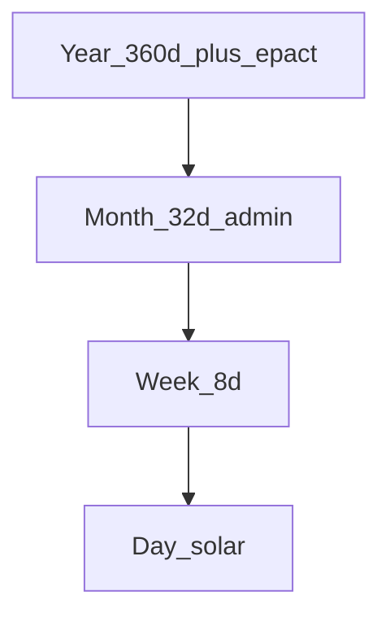

# System: Binary

**Idea:** Optimize **hierarchical scheduling** with \(W = 2^3 = 8\) days; treat the Moon as **out of band**.

Rome’s **8-day nundinae** (market cycle) is the same design knob: **market and halves**, not lunar quarter ([why-seven.md](../05-synthesis/why-seven.md)).

## Units

| Unit | Definition |
|------|------------|
| Day | Mean solar day |
| Week | **8 days** (3-bit counter 0–7 or 1–8) |
| Month | **4 weeks = 32 days** (administrative) |
| Year | **45 weeks = 360 days** + **epact block** 5.242 d |



## Week structure

```
8 days
├── 4 days (half-week)
│   ├── 2 days
│   └── 2 days
└── 4 days
    ├── 2 days
    └── 2 days
```

Day names: **bit pairs** or ordinals 1–8.

## Rest rule

Day **8** rest each week (or days 4 and 8 for half-week rests - policy; default **day 8 only**).

## Lunar stance

Synodic month / 8 = 3.691 weeks - **no** lunar claim. Phases displayed as **overlay** (optional app/ephemeris), not grid input.

## Intercalation (solar)

\[
45 \times 8 = 360\ \text{d} \quad vs \quad 365.242\ \text{d}
\]

**Epact block** at year end: **5 epact days** (no week number), plus every 4th year add **1** leap epact day → mean 365.25 (Julian-like simplicity).

Alternative: **6-day epact week** (week 46) every year with variable length - heavier cognitively.

Default: **5 epact days** + leap epact day in leap year.

## Month vs moon

32-day month × 12 = 384 d - **not** tropical. Binary is **not** a lunisolar calendar; “month” is ** fiscal / planning** only.

Rename optional: **octade** (8 d), **tetrade** (32 d).

## Failure modes

| Failure | Consequence |
|---------|-------------|
| Tidal planning | User must use Lune overlay |
| Seasonal drift | Epact block must be honored |
| Global habit | 8-day rhythm unfamiliar |

## Walkthrough: one year start

- Weeks **1–45**: normal 8-day cycles, day 8 rest.
- Days **361–365**: Epact 1–5 ( festivals / year-end ).
- Leap year: Epact 6.

## When to choose Binary

- Logistics, shifts, binary computers, power-of-two planning
- **Solar** year via epact acceptable
- **Moon ignored** for civil grid
