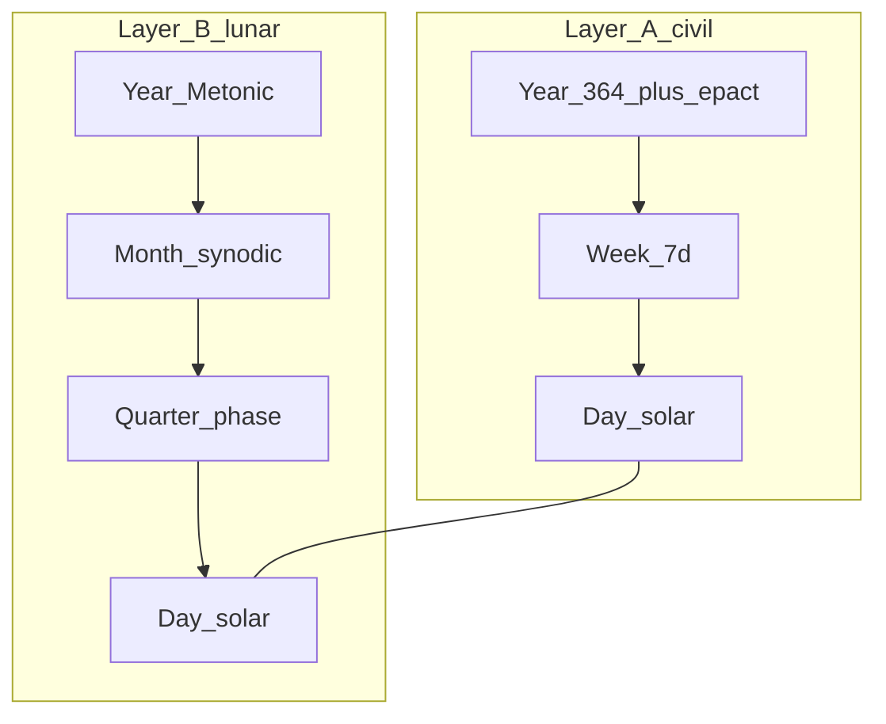

# System: Dual

**Idea:** Refuse a single week. Run **two overlays** that need not nest.

## Layer A - Civil (integer)

| Unit | Value |
|------|--------|
| Week | **7 days**, ordinals 1–7 |
| Rest | Day 7 |
| Year | 52×7 = 364 + **1 epact day** (+ leap rules) |
| Month | **None required** - optional 30/31 solar months for finance |

Purpose: appointments, contracts, trains, payroll.

## Layer B - Phase (lunar)

| Unit | Value |
|------|--------|
| Quarter | Mean 7.382647 d between major phases |
| Month | Synodic lunation |
| Year | Metonic 19-y |

Purpose: tides, ecology, night sky, optional rest at full moon.

Java/Bali-style **overlapping** 3-, 5-, and 7-day counts are a historical analogue: several rhythms at once, not one nested week ([why-seven.md](../05-synthesis/why-seven.md)).

The link between layers is **labels only** - not nested grids.

## Labels on each civil day

Every civil date carries:

- `(week_day: 1–7, week_index)`
- `(lunar_day: days since new moon, 0–29)`
- `(phase_name: wax | quad | full | wane)`

**No algorithm forces** week_day 1 to align with new moon.

## Intercalation split

| Layer | Epact |
|-------|--------|
| Civil | Year-end epact day(s); Gregorian leap day optional |
| Lunar | Metonic leap months; phase reset at new moon |

Corrections **do not propagate** across layers except on printed combined label.

## Rest rule

- **Civil:** day 7 rest (weekly).
- **Optional lunar:** rest on civil day **closest to full moon** (may shift ±1 d) - second rest if collision with day 7.

## Failure modes

| Failure | Mitigation |
|---------|------------|
| Cognitive load | UI shows both stamps |
| “Which is real?” | Document: civil for law, phase for nature |
| Redundant cycles | Feature, not bug |

## Walkthrough: sample civil week

Civil: Mon-like ordinal **1–7** (unnamed), rest on 7.

Lunar stamp might read: **Lunar day 14, full moon ±0**, while civil day 3 - **no contradiction**.

After ~29.5 lunar days, phase month completes; civil weeks keep counting 7s independently.

## When to choose Dual

- Modern global economy **needs** integer 7-ish rhythm
- Environmental / tidal work **needs** phases
- You accept **honest non-nesting** instead of false unity

## Relation to other systems

- **Lune** alone if civil drift OK
- **Mix** if you insist one grid with epact days
- **Dual** if both grids stay pure
