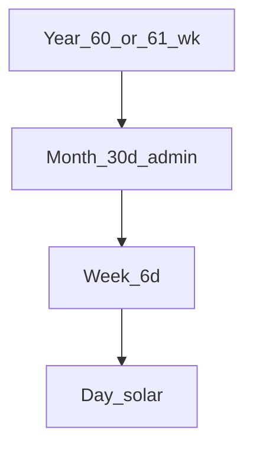

# System: Hex

**Idea:** Choose **W = 6** - under **Score_int** and **Score_ref** in [integer-weeks.md](../03-search/integer-weeks.md), the highest-scoring integer among W=1…30 - as a full civil calendar, not only a search-table row.

## Units

| Unit | Definition |
|------|------------|
| Day | Mean solar day |
| Week | **6 days** |
| Month | **5 weeks = 30 days** (administrative) |
| Year | **60 or 61 weeks** via leap-week rule (see below) |



## Week structure

```
6 days
├── 3 days (half-week)
│   └── 3 days (third-week)
└── 3 days
    └── 3 days
```

Day names: ordinals 1–6, or **hex** labels (bit-style 2+2+2 splits for shifts).

## Rest rule

Day **6** rest each week (default **1 rest on day 6**).

## Search scores (W = 6, fixed weights)

From [scoring.md](../00-method/scoring.md) / [integer-weeks.md](../03-search/integer-weeks.md):

| Term | Value | Note |
|------|-------|------|
| M | 0.922 | High among small W - **coincidence** of round(29.53/6)=5 weeks/lunation, not phase design |
| Q_prox | 0.813 | Below 7 and 8 on quarter proximity |
| S | 0.539 | Weak spring–neap alignment |
| Y | **0.874** | Strong tropical-year fraction vs W=7 (0.823) |
| D_norm | **0.833** | 6 = 2×3; better shift splits than prime 7 (0.333) |
| **Score_int** | **0.729** | Highest among W=1…30; +0.006 over W=7 |
| **Score_ref** | **0.828** | Highest among W=1…30 in that composite |

Hex is **not** a lunar-first system despite decent **M**; weak **S** and no phase grid. See [weight-sensitivity.md](../03-search/weight-sensitivity.md).

## Intercalation (leap week)

\[
365.242 / 6 = 60.874\ \text{weeks/year}
\]

**Default civil model:** alternate **long** and **short** years on an 8-year wheel:

| Years in block | Weeks | Days |
|----------------|-------|------|
| 7 long | 61 each | 366 each |
| 1 short | 60 | 360 |
| **8-year mean** | 60.875 wk/yr | **365.25 d/yr** |

Leap **week** (week 61, six days) absorbs ~0.758 d excess vs 365.242 in long years; short year pulls mean toward Julian-like 365.25. Residual vs mean tropical year (~0.008 d/yr) needs a longer correction cycle (same *shape* as Julian → Gregorian), not claimed here as a finished reform.

Alternative: always **61 weeks** (366 d) + rare omitted day - heavier cognitively; not default.

Details: [intercalation.md](../03-search/intercalation.md).

## Month vs moon

30-day admin month ≠ synodic (29.530589 d). Five weeks × 6 d = 30 d; **E_moon** if forced to one week count per lunation is **0.469 d** (see integer-weeks table) - better ratio score than 7, but **four equal weeks** per month would be 24 d (−5.531 d vs synodic). Hex does **not** close the month on phases; use **Lune**, **Mix**, or **Dual** overlay if needed.

## Divisibility

6 splits into **2×3**, **3+3**, or **2+2+2** - relevant to factory shifts and roster planning. This is the main practical payoff over W=7 besides **Y**.

## Failure modes

| Failure | Note |
|---------|------|
| Lunar festivals | Require Dual/Lune/Mix overlay |
| Spring–neap planning | Weak S; not tide-first |
| Leap week familiarity | Rare in real-world calendars; document the 8-year wheel |
| “Leader = correct” | 0.006 above W=7 on Score_int is weight noise |

## Walkthrough: weeks 1–2 of a long year

| Civil day | Week | Day-in-week | Note |
|-----------|------|-------------|------|
| 1 | 1 | 1 | work |
| … | 1 | 6 | **rest** |
| 7 | 2 | 1 | work |
| … | 2 | 6 | **rest** |

Weeks 1–60 (or 1–61 in a long year) follow; week 61 in long years is a full 6-day week before year-end festivals if any.

## When to choose Hex

- Integer **6-day** rhythm acceptable globally
- **Year fit** and **shift divisibility** matter more than phase fidelity or spring–neap
- You want the scored **W=6** design written out as a system, not only a table rank

Compare: **Mix** if lunisolar 7/8 grid is mandatory; **Solar5** if W=5 year-first; **Dual** if civil 7 + lunar overlay.
