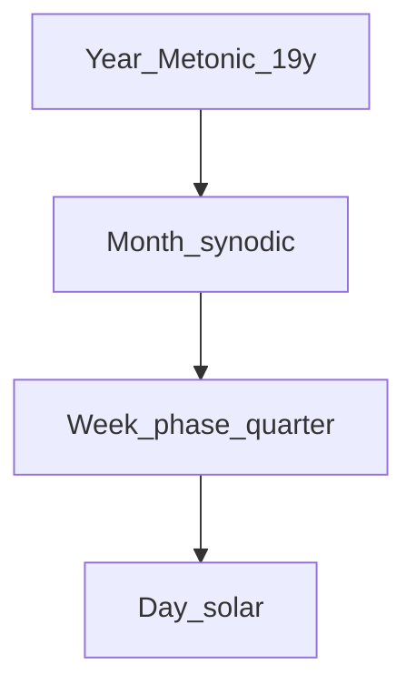

# System: Lune

**Idea:** Bind the short cycle to **lunar phase**, not to a fixed integer day count.

## Units

| Unit | Definition |
|------|------------|
| Day | Mean solar day (86400 s) |
| Week | **Phase quarter** - mean 7.382647 d from new → first quarter → full → third quarter → new |
| Month | One **synodic** lunation (mean 29.530589 d) |
| Year | Tropical year; **7 leap months per 19 years** (Metonic) for month–year lock |



## Week structure

Four phase weeks per month (exact in mean ratio):

1. **New → First quarter**
2. **First quarter → Full**
3. **Full → Third quarter**
4. **Third quarter → New**

Day names: **ordinal within quarter** (Day 1 … Day 7 or 8) plus **phase label** (Waxing crescent sector, etc.) if desired - not weekday names.

## Rest rule

**Rest** on the calendar day containing **phase maximum** (full moon night) and optionally **new moon** (dark night). Alternatively: one rest day when ordinal day = 7 within each quarter block - policy choice; default **phase rest at full moon**.

## Circadian lock tradeoff

Quarter boundaries occur at **astronomical instants**, not at midnight. Two modes:

- **A (faithful):** Week rolls at phase instant → boundary **walks** through clock time (~9.18 h slip per 7-day equivalent vs integer 7).
- **B (civil snap):** Nearest midnight to phase instant → **±12 h** phase error max; better for appointments.

Lune **defaults to A** for astronomy; Dual system uses B on civil overlay.

## Intercalation

- **Month–year:** Metonic 19-y cycle (235 months in 19 tropical years).
- **Week–month:** None needed in mean sense - four quarters = one synodic month by definition.
- **Day–quarter:** Individual quarters vary ±~6 h around 7.38 d; **observation** or ephemeris rules label the day of phase.

## Failure modes

| Failure | Cause | Mitigation |
|---------|-------|------------|
| “Monday drift” | Non-integer quarter | Accept or use Dual civil week |
| Polar scheduling | Phase vs daylight | Use clock day + phase stamp |
| Cloudy sky | Observation | Ephemeris fallback |

## Walkthrough: one phase week

- **Day 0 (event):** New moon at 14:32 UTC.
- **Days 1–7:** Count mean solar days; waxing crescent visible evenings.
- **~Day 7.38 (event):** First quarter at instant T₁.
- Civil date of T₁ may be **day 7 or 8** depending on time - epact within quarter is **hours**, not a full day if mode A.

## Nesting

Tree for **lunar** view:

```
Year (Metonic) → Month (synodic) → Quarter (phase week) → Day
```

Solar **tropical year** does not contain an integer number of phase weeks; Metonic handles **month/year** only.

## When to choose Lune

- Tides and night-sky phases matter more than integer weekdays.
- You accept **non-integer** week or midnight-snapped phases.
- You want **honest** astronomy over spreadsheet convenience.
