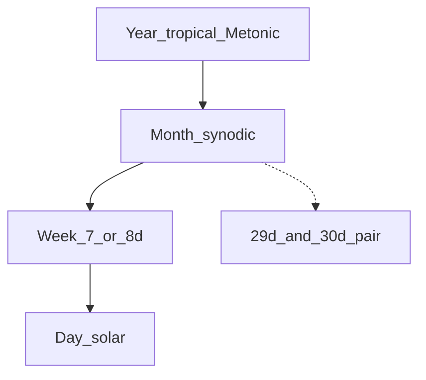

# System: Mix

**Idea:** Keep **integer** weeks and **circadian lock**, but alternate **7-day** and **8-day** weeks so the mean approaches the lunar quarter (7.382647 d).

## Units

| Unit | Definition |
|------|------------|
| Day | Mean solar day |
| Week | 7 or 8 days per repeating pattern |
| Month | Synodic; anchored at **observed or computed new moon** |
| Year | Tropical + Metonic leap months |

## Core pattern (59-day octave)

Repeat every **8 weeks** / **59 days**:

| Week # | Length | Cumulative days |
|--------|--------|-----------------|
| 1 | 7 | 7 |
| 2 | 7 | 14 |
| 3 | 8 | 22 |
| 4 | 7 | 29 |
| 5 | 7 | 36 |
| 6 | 8 | 44 |
| 7 | 7 | 51 |
| 8 | 8 | 59 |

Composition: **5×7 + 3×8 = 59**; mean week **7.375 d** (error vs quarter −0.00765 d ≈ **11 min/week**).

## Rest rule

Last day of each week (day 7 or day 8) is **rest**.

## Month closure

Each **59-day block** = **two months**, four weeks each:

- **Month A (29 d):** W1–W4 → 7+7+8+7  
- **Month B (30 d):** W5–W8 → 7+8+7+8  

Pair vs 2× synodic: **−0.061 d** per two months (~1.47 h), not −0.531 d every single month.

Over **235 months** (Metonic): 110×29 + 125×30 = **6940 d** = 940 weeks (580×7 + 360×8). Details: [metonic-week-grid.md](../03-search/metonic-week-grid.md).

## Intercalation

| Layer | Rule |
|-------|------|
| Month–year | 7 leap months / 19 years (Metonic); lunar residual ~12.8 h / 19 y on 6940-d grid |
| Week–month | **No epact day inside** 235-month core; 29/30 alternation absorbs error |
| Year–day | Optional **1 day / ~76 y** (or leap-day policy) for ~9.6 h solar residual / 19 y |

## Failure modes

| Failure | Mitigation |
|---------|------------|
| People forget 7 vs 8 | Publish perpetual 59-day wheel |
| Month ≠ 4 weeks exactly | Use 29/30 pair; see metonic grid |
| Year not multiple of 59 | Solar leap days **outside** 59-day wheel |

## Walkthrough: days 1–22 (start of pattern)

| Civil day | Week | Day-in-week | Note |
|-----------|------|-------------|------|
| 1 | 1 | 1 | work |
| … | 1 | 7 | rest |
| 8 | 2 | 1 | work |
| … | 2 | 7 | rest |
| 15 | 3 | 1 | work |
| … | 3 | 8 | rest (long week) |
| 23 | 4 | 1 | … |

After day 59, pattern repeats; week numbers 1–8 recycle.

## When to choose Mix

- Integer days **non-negotiable**
- Lunar quarter alignment **important** but exact phase instants **optional**
- Willing to run **epact days** monthly
