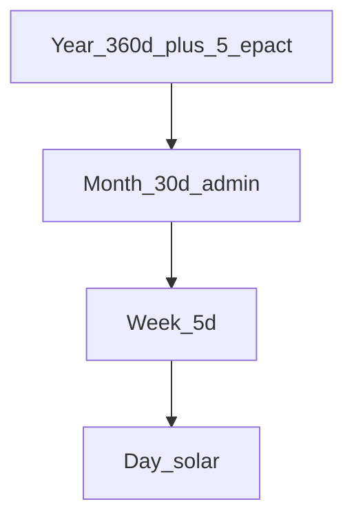

# System: Solar5

**Idea:** Choose **W = 5** for a strong small-integer fit to the **tropical year**.

## Units

| Unit | Definition |
|------|------------|
| Day | Mean solar day |
| Week | **5 days** |
| Month | **6 weeks = 30 days** (administrative) |
| Year | **72 weeks = 360 days** + **5 epact days** (+ leap day in leap year) |

## Arithmetic

\[
365.242 / 5 = 73.048\ \text{weeks/year}
\]

**Civil year model (default):**

\[
72 \times 5 = 360\ \text{d} + 5\ \text{epact days} = 365\ \text{d}
\]

Leap year: **6th epact day** (366 d). Mean ≈ 365.25 d with simple 4-year rule.

Alternative (not combined with 5 epact days): **73 weeks flat = 365 d** and leap day only (~0.242 d/yr short).

## Rest rule

Day **5** each week rest (default **1 rest on day 5**).

## Lunar stance

**~5.9 weeks per synodic month** (29.530589 / 5 ≈ 5.906). No phase alignment; Moon as overlay.

## Month note

30-day month ≠ synodic. Twelve admin months = 360 d; the **5 epact days** finish the solar year (see above).

## Divisibility

5 is prime; splits 5 or 2+3. Strong **Y** term in week search; weak lunar fit.

## Failure modes

| Failure | Note |
|---------|------|
| Lunar festivals | Require Dual/Lune overlay |
| 5-day work rhythm | Unfamiliar |
| Month ≠ moon | By design |

## Walkthrough: week 1 of year

| Day-in-week | 1 | 2 | 3 | 4 | 5 |
|-------------|---|---|---|---|---|
| Activity | work | work | work | work | **rest** |

Weeks 1–72, then epact days 1–5 (and 6 in leap year); week 1 restarts.

## When to choose Solar5

- **Solar** seasons dominate
- Prefer **Y** and simple epact block over lunar month closure
