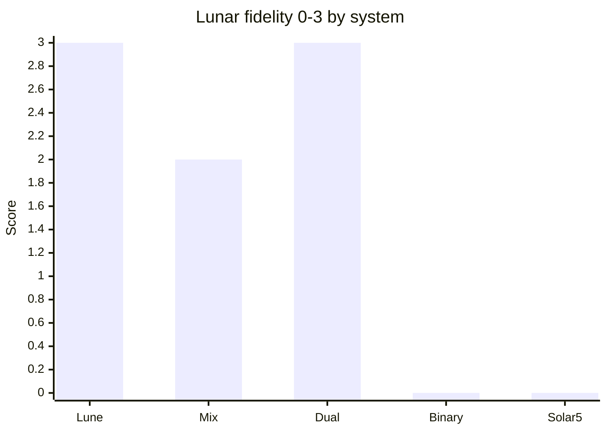
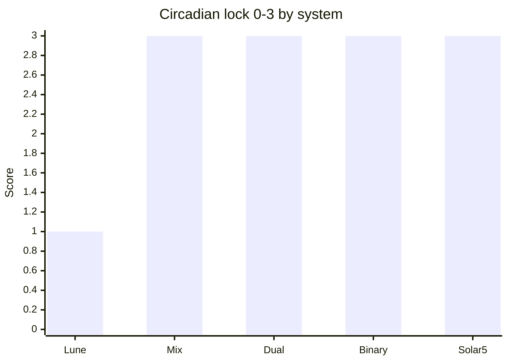

# Comparison and Pareto front

No single system wins all criteria.

> [!NOTE]
> Charts are subjective on quadrants; numeric week search is in [03-search/integer-weeks.md](../03-search/integer-weeks.md).

**More charts:** [systems-quadrant.md](../06-visual/systems-quadrant.md) · [choose-a-system.md](../06-visual/choose-a-system.md)

This table compares the five designs in [04-systems/](../04-systems/) on **orthogonal goals**.

Legend: ++ strong, + acceptable, ~ weak, − poor, n/a not targeted.

| Criterion | Lune | Mix | Binary | Solar5 | Dual |
|-----------|------|-----|--------|--------|------|
| Lunar quarter fidelity | ++ | + | − | − | ++ (layer B) |
| Synodic month closure | ++ | + | − | − | ++ (layer B) |
| Tropical year closure | + (Metonic) | + | + (epact) | ++ | + (civil) |
| Circadian / integer lock | ~ (A) / + (snap) | ++ | ++ | ++ | ++ (civil) |
| Scheduling divisibility | ~ | + | ++ | ~ | + (civil) |
| Cognitive simplicity | + | ~ | + | + | − |
| Tidal usefulness | ++ | + | n/a | n/a | ++ |
| Honest about epact | ++ | ++ | ++ | ++ | ++ |

## Integer week leaderboard (search only)

From [integer-weeks.md](../03-search/integer-weeks.md) **Score_int**:

1. **W=6** (0.729) - strong M, Q, **Y (0.874)**, D; weak S
2. **W=7** (0.723) - Dual civil layer; best Q_prox
3. **W=5** (0.715) - Solar5
4. **W=8** (0.702) - Binary

Gap 6 vs 7 is **0.006**; see [weight-sensitivity.md](../03-search/weight-sensitivity.md). **7 is not the unique optimum** on any single weight vector.

## Pareto front (informal)

Designs **not dominated** on (quarter error, year error, divisibility):

- **Lune** - minimizes quarter/month error; sacrifices clock lock (mode A).
- **Mix** - best **integer lunisolar week grid** here (7/8, 29/30 months, Metonic 6940 d); see [metonic-week-grid.md](../03-search/metonic-week-grid.md).
- **Binary** - maximizes \(2^n\) scheduling; sacrifices Moon.
- **Solar5** - minimizes week–year fraction; sacrifices Moon.
- **Dual** - minimizes **conflict** by splitting objectives; pays dual-label complexity.

Choosing one is choosing **which epact you carry**.

## Residual summary (order of magnitude)

| System | Dominant residual | Typical correction |
|--------|-------------------|-------------------|
| Lune | Sub-day phase vs midnight | Instant vs snap policy |
| Mix | ~12 h / 19 y on 6940-d grid | Metonic; optional 1 d / 76 y solar |
| Binary | 5.24 d/year vs 360 | Epact block + leap |
| Solar5 | 0.24 d/year vs 365 | Leap day |
| Dual | Civil 1.24 d/year (364) | Epact day; lunar Metonic |

## Failure mode matrix

| Risk | Worst hit | Safest |
|------|-----------|--------|
| Tide tables | Binary, Solar5 | Lune, Dual-B |
| Payroll weekly | Lune mode A | Mix, Dual-A |
| Night-sky rituals | Binary | Lune |
| Power-of-two shifts | Solar5 | Binary |
| Legal simplicity | Dual | Solar5 |

## Recommendation stance (Epact)

Epact **does not crown a winner**. It documents that:

1. Nature’s ratio **quarter/day** is **7.382647…**, not 7.
2. Integer **6, 7, 8** are **compromises** on a scored front, not truths.
3. **Mixed weeks** and **dual overlays** are logically superior to pretending one integer fits all cycles.

Pick **Lune** or **Dual** if phases matter; **Mix** if integers are mandatory; **Solar5** or **Binary** if the Sun (or binary logistics) dominates.

See [open-questions.md](open-questions.md) for unresolved choices.
