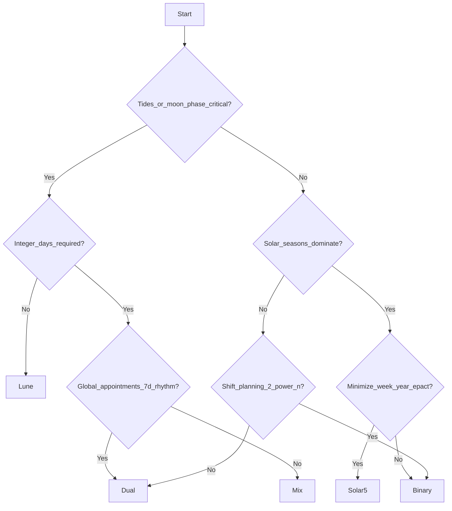

# Choose a system (flowchart)

Start from **what must not drift**. For **why the world uses 7 today** (vs Egypt 10, Rome 8, USSR 5/6, etc.), see [other-weeks.md](other-weeks.md) and [why-seven.md](../05-synthesis/why-seven.md).



```
Moon/tides critical? → integer days? → 7d appointments? → Lune / Mix / Dual
Else solar seasons? → minimize year epact? → Solar5 / Binary
```

## Match to files

| Outcome | Read |
|---------|------|
| Lune | [lune.md](../04-systems/lune.md) |
| Mix | [mix.md](../04-systems/mix.md) |
| Dual | [dual.md](../04-systems/dual.md) |
| Solar5 | [solar5.md](../04-systems/solar5.md) |
| Binary | [binary.md](../04-systems/binary.md) |
| Hex | [hex.md](../04-systems/hex.md) |

## Biology reminder


[biology.md](../01-nature/biology.md)
