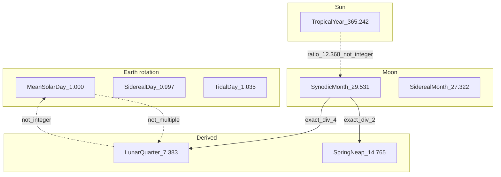
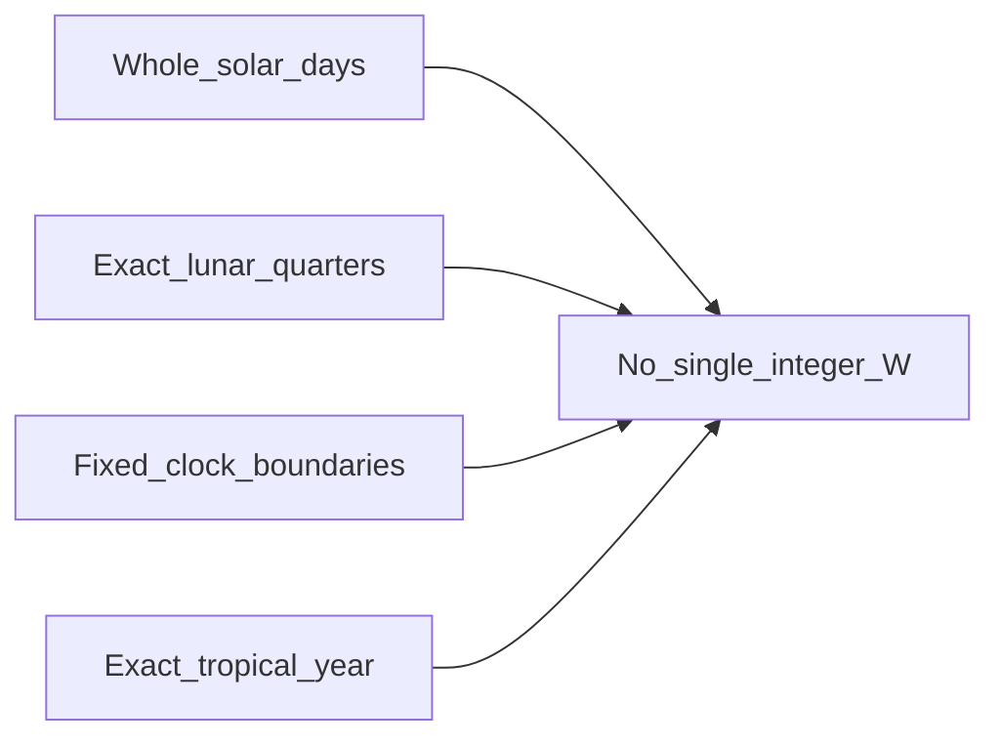

# Cycle map

Mean periods in **mean solar days**. Edges show division or mismatch.



## Incommensurability (concept)



## ASCII fallback

```
Tropical year 365.242 d  ──×──  Synodic month 29.531 d  (ratio ≈ 12.368)
Synodic / 4 = 7.383 d    ──×──  Integer day grid      (7.383 ∉ ℤ)
Four × 7 d = 28 d         ──×──  One lunation          (−1.53 d)
```

See [00-method/impossibility.md](../00-method/impossibility.md).
