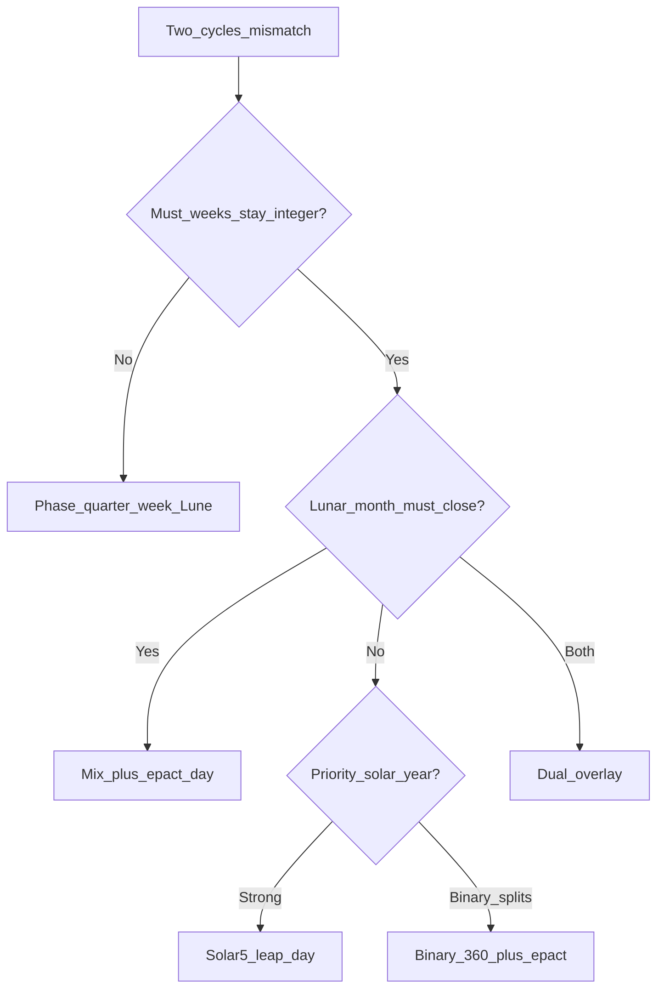
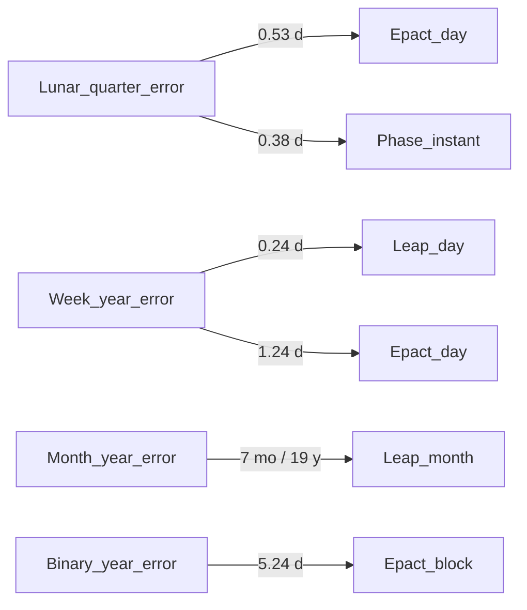

# Where epact goes

When two cycles are forced together, remainder must be stored somewhere.

## Decision flow



## Epact sinks (flowchart)

Illustrative **day-equivalents per cycle** (not conserved flux):



| Source | Sink | Scale |
|--------|------|-------|
| Lunar quarter error | Epact day | ~0.53 d / lunation |
| Lunar quarter error | Phase instant | ~0.38 d / quarter |
| Week vs year | Leap day | ~0.24 d / year |
| Week vs year | Epact day | ~1.24 d / year |
| Month vs year | Leap month | 7 / 19 years |
| Binary 360 vs year | Epact block | ~5.24 d / year |

## ASCII

```
Mismatch type          Typical sink
─────────────────────────────────────
28 d vs 29.53 d month  → 1 epact day / lunation (Mix)
364 d vs 365.24 y      → 1–2 epact days / year (Dual civil)
360 d vs 365.24 y      → 5-day epact block (Binary)
7.38 d quarter         → phase instant OR 7/8 mix (Lune / Mix)
```

Details: [intercalation.md](../03-search/intercalation.md).
