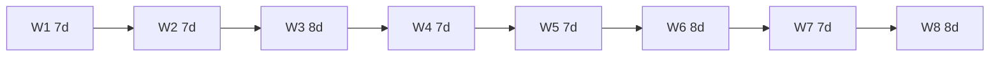
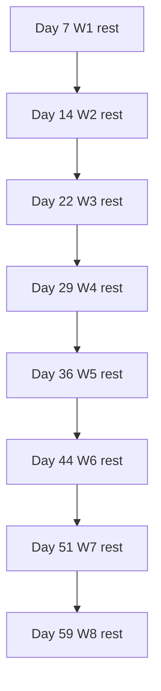

# Mixed 59-day / 8-week pattern

Repeating block from [mix.md](../04-systems/mix.md): **5x7 + 3x8 = 59 days**.

## Week lengths (flowchart)



Cumulative days: 7, 14, 22, 29, 36, 44, 51, **59**.

## Rest days (last day of each week)



## ASCII strip

```
|←7→|←7→|←──8──→|←7→|←7→|←──8──→|←7→|←──8──→|
  W1   W2    W3     W4   W5    W6     W7    W8
  R    R     R      R    R     R      R     R     (R = rest on last day)
```

Mean week = 59/8 = **7.375 d**.
