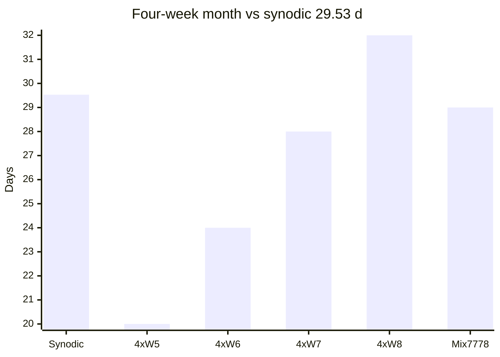
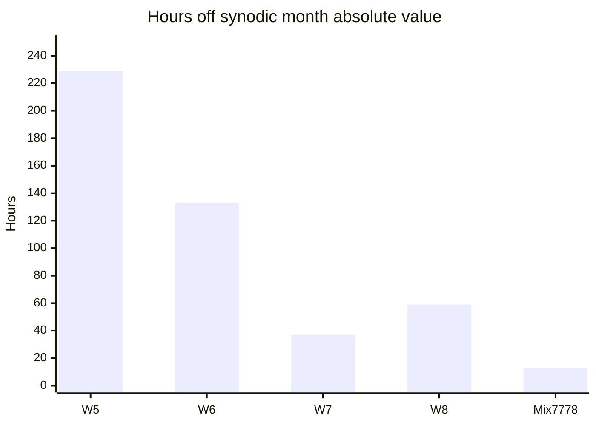

# Four weeks vs one synodic month

If one "month" is forced to **exactly four equal integer weeks**, length = **4W** days. Compare to synodic **29.530589 d**.

## Bar comparison



| Label | Days |
|-------|------|
| Synodic | 29.531 |
| 4xW5 | 20 |
| 4xW6 | 24 |
| 4xW7 | 28 |
| 4xW8 | 32 |
| Mix 7+7+7+8 | 29 |

## Error magnitude (hours per lunation)

Absolute deficit/surplus vs synodic (sign in table):



| Pattern | Signed error (h) |
|---------|------------------|
| W5 | -229 |
| W6 | -133 |
| W7 | -37 |
| W8 | +59 |
| Mix 7+7+7+8 | -13 |

## Mixed pattern within one lunation


```
[--7--][--7--][--7--][---8---]  = 29 d  (short ~12.7 h vs 29.531 d)
```

Residual vs 29.531 d: **-0.53 d (~12.7 h)** → one **epact day** in Mix system.

## ASCII

```
Synodic month     |██████████████████████████████| 29.53 d
4 x 7-day weeks   |████████████████████████████    | 28.00 d  (-36.7 h)
4 x 8-day weeks   |████████████████████████████████| 32.00 d  (+59.2 h)
7+7+7+8           |█████████████████████████████   | 29.00 d  (-12.7 h)
```

See [month.md](../02-units/month.md), [intercalation.md](../03-search/intercalation.md).
