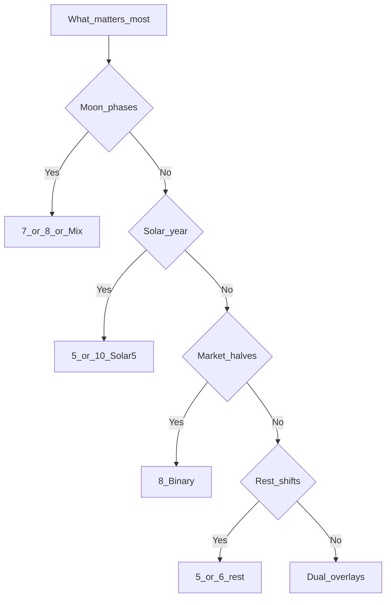

# Other week lengths (historical targets)

Maps **why** some cultures did not use 7 - same design knobs as Epact. Full table: [why-seven.md](../05-synthesis/why-seven.md).



## ASCII

```
Priority          Example W    Epact file
─────────────────────────────────────────
Moon + integer    7, 8, mix    Mix, Lune
Solar year        5, 10        Solar5
Market / 2^n      8            Binary
Rest / factory    5, 6         rest.md
Several rhythms   3+5+7        Dual
Ritual counts     13, 20       cycles.md (not a civil week)
Global today      7            copied package (why-seven.md)
```
