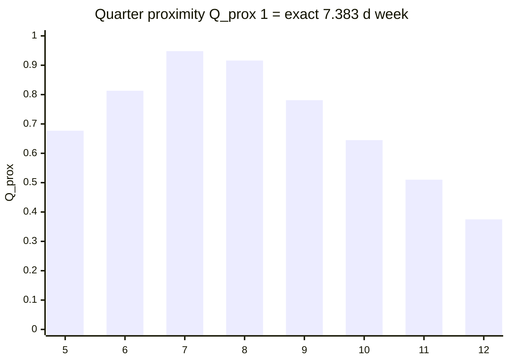
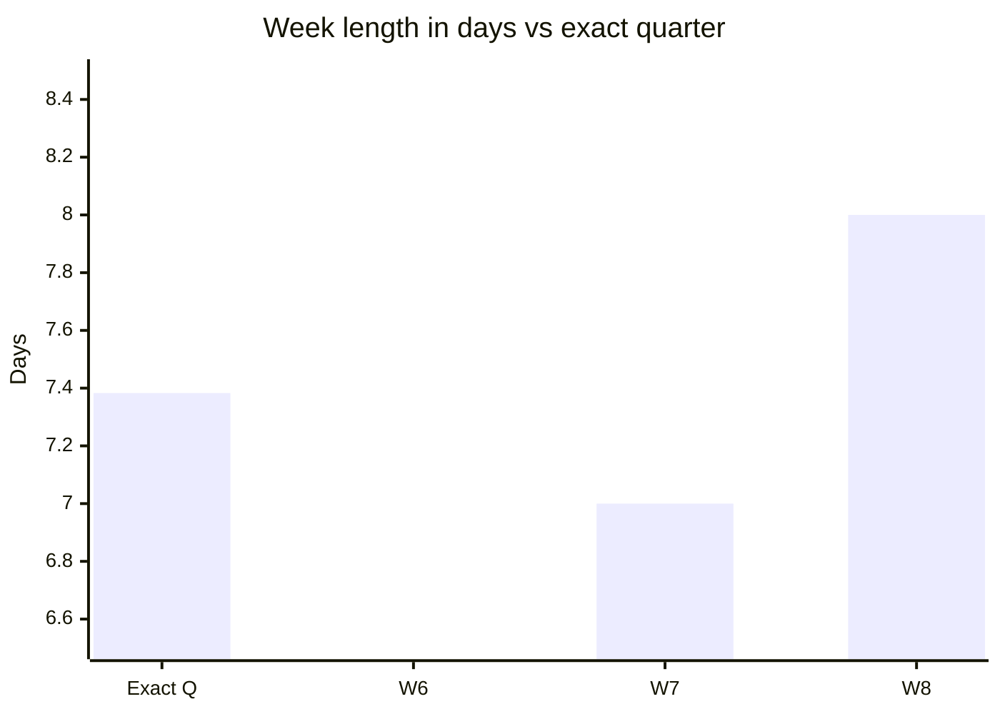
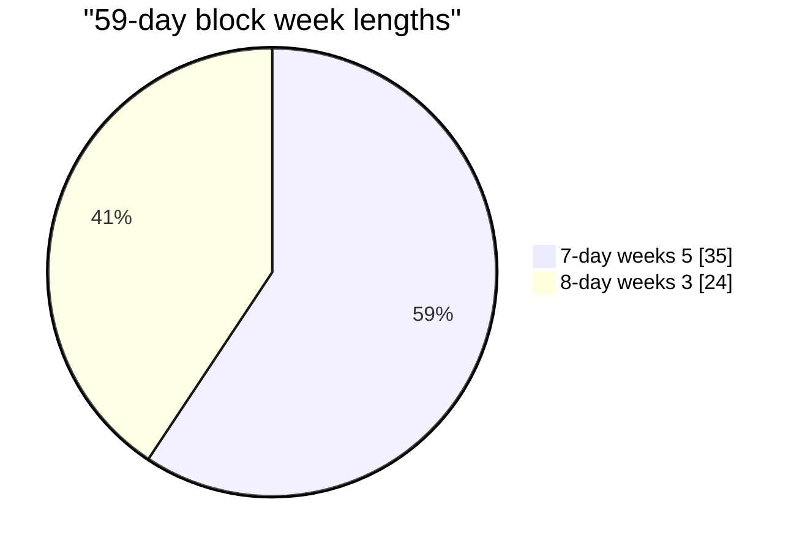

# Distance to lunar quarter (7.382647 d)

Target: mean **phase quarter** = synodic month / 4.

## Proximity score Q_prox(W)



## Integer vs exact quarter



| | Days |
|---|------|
| Exact Q | 7.383 |
| W6 | 6 |
| W7 | 7 |
| W8 | 8 |

## Mixed mean (59/8 block)



Mean = 59/8 = **7.375 d** (11 min short of 7.383 d per week).

## ASCII

```
Exact quarter     7.383 d  |-----------------|  target
W=7               7.000 d  |--------------    |  short ~9.2 h / quarter
W=8               8.000 d  |-----------------|--+  long ~14.8 h / quarter
Mix 59/8          7.375 d  |----------------|   |  short ~11 min / week
```

See [mixed-weeks.md](../03-search/mixed-weeks.md).
