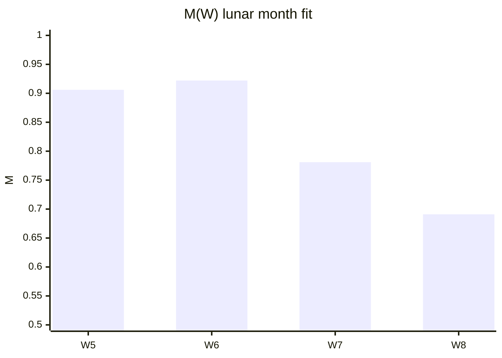
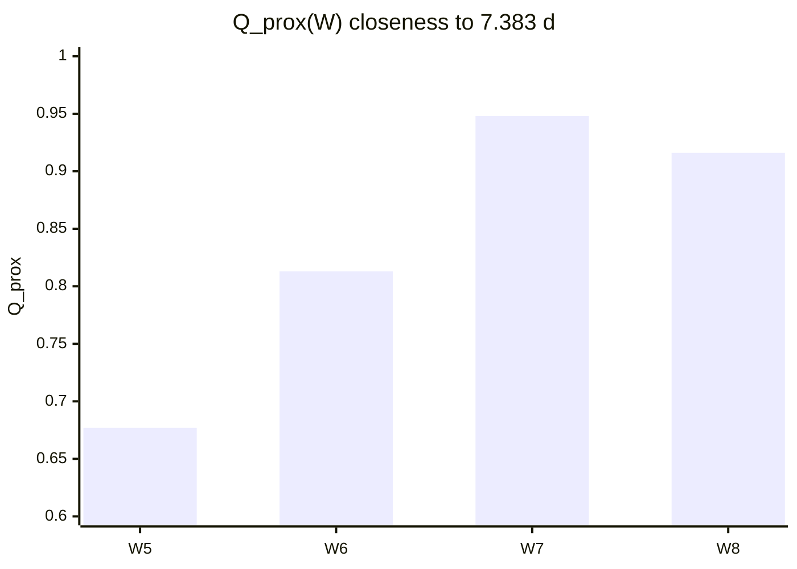
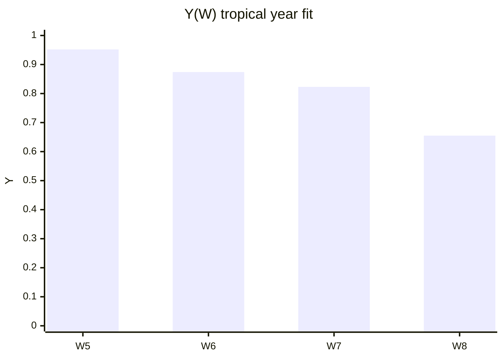
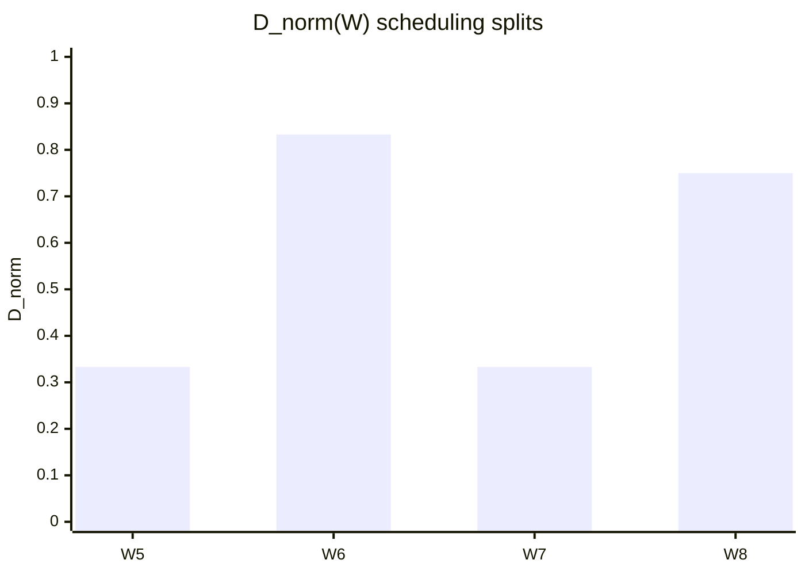
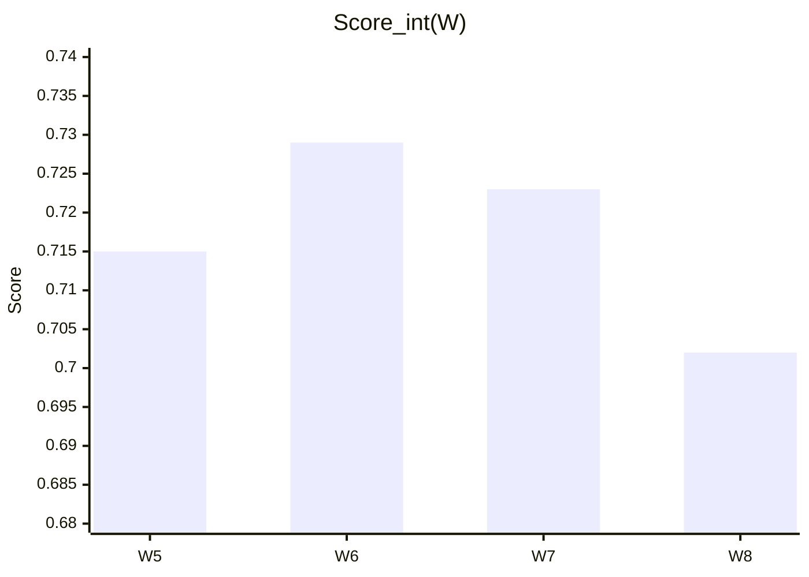

# Score components (W = 5, 6, 7, 8)

Same weights as [scoring.md](../00-method/scoring.md). Compare **why** totals differ.

## Moon alignment M(W)



| W | M |
|---|---|
| 5 | 0.906 |
| 6 | 0.922 |
| 7 | 0.781 |
| 8 | 0.691 |

## Quarter proximity Q_prox(W)



## Tropical year alignment Y(W)



## Divisibility D_norm(W)



## Score_int (same four W)



## Stacked intuition (ASCII)

```
Component      W=5    W=6    W=7    W=8
─────────────────────────────────────────
M (moon)       ███    ███    ██     ██
Q (quarter)    ██     ██▊    ███▊   ███▋
Y (year)       ███▊   ███▊   ██▋    ██▌
D (divide)     █      ██▊    █      ██▌
─────────────────────────────────────────
Score_int      .715   .729   .723   .702
```

W=6 leads **Score_int**; W=7 wins **quarter** and **S**; W=6 wins **Y** over 7; W=5 wins **Y** among small W.
