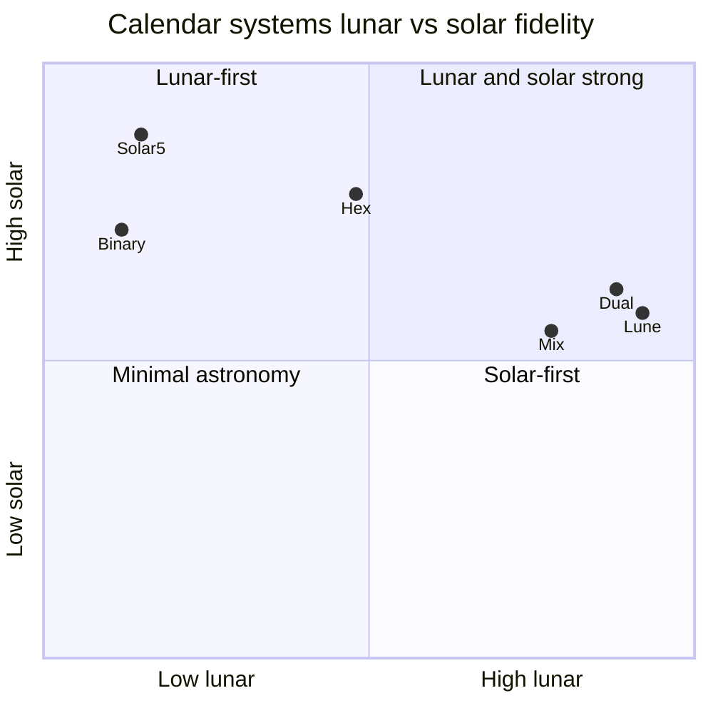
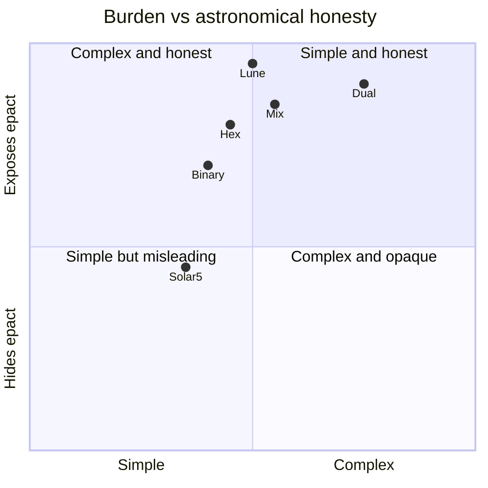
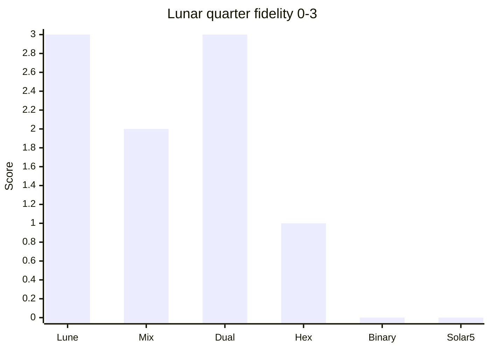
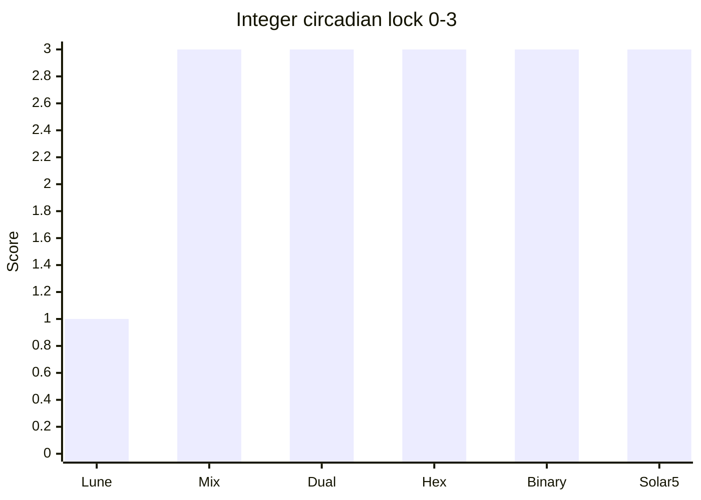

# Six systems: lunar vs solar priority

Subjective placement for **discussion** (0 = low, 1 = high). Not additional computed scores.



```
        High solar
            |  Solar5
            |  Binary
            |        Dual
            |   Lune  Mix
        Low solar +------------------ High lunar
```

## Complexity vs honesty



## Fallback bars (same intent as quadrants)

Criteria from [comparison.md](../05-synthesis/comparison.md), encoded 0-3:





| System | Lunar (0-3) | Circadian lock (0-3) |
|--------|-------------|----------------------|
| Lune | 3 | 1 |
| Mix | 2 | 3 |
| Dual | 3 | 3 |
| Hex | 1 | 3 |
| Binary | 0 | 3 |
| Solar5 | 0 | 3 |

See system docs in [04-systems/](../04-systems/).
