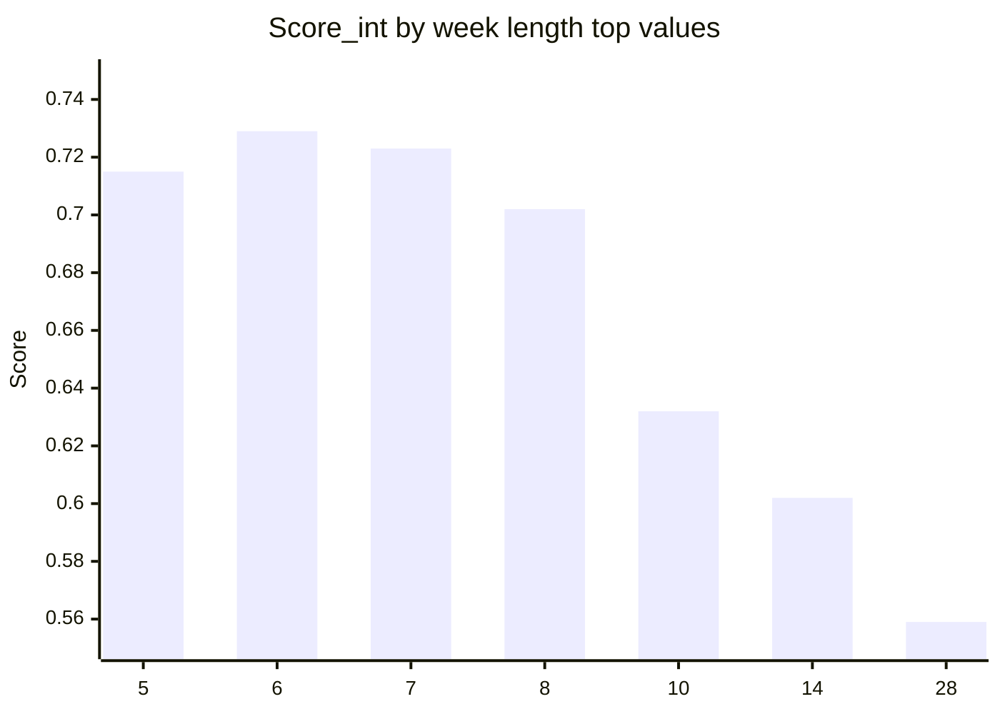
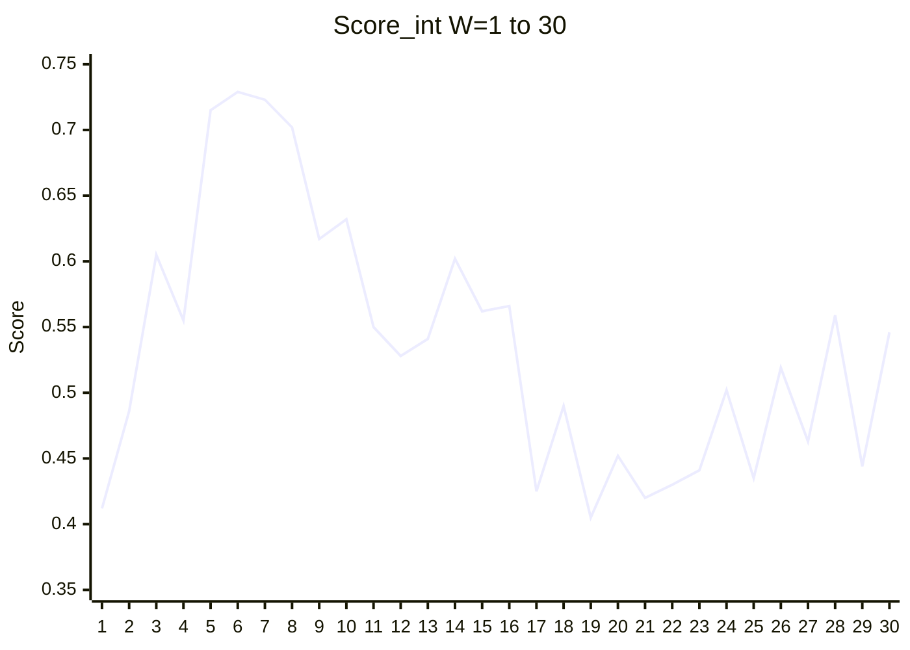

# Composite week scores (W = 1 … 30)

Weights: [scoring.md](../00-method/scoring.md) **Score_int** (no +0.10 circadian constant).

## Top candidates (bar)



## Full range (line)



## ASCII leaderboard

```
W=6  ████████████████████ 0.729  ← Score_int leader
W=7  ███████████████████▊ 0.723  ← best quarter proximity
W=5  ███████████████████▌ 0.715  ← strong Y
W=8  ███████████████████  0.702  ← binary scheduling
```

Legacy Score (+0.10 C): 6=0.829, 7=0.823, 5=0.815.

Full table: [integer-weeks.md](../03-search/integer-weeks.md).
