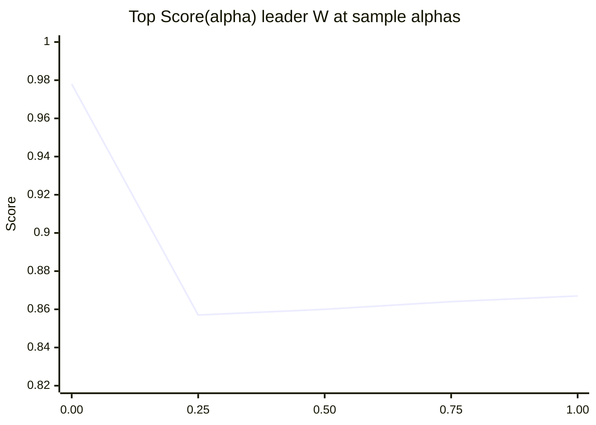
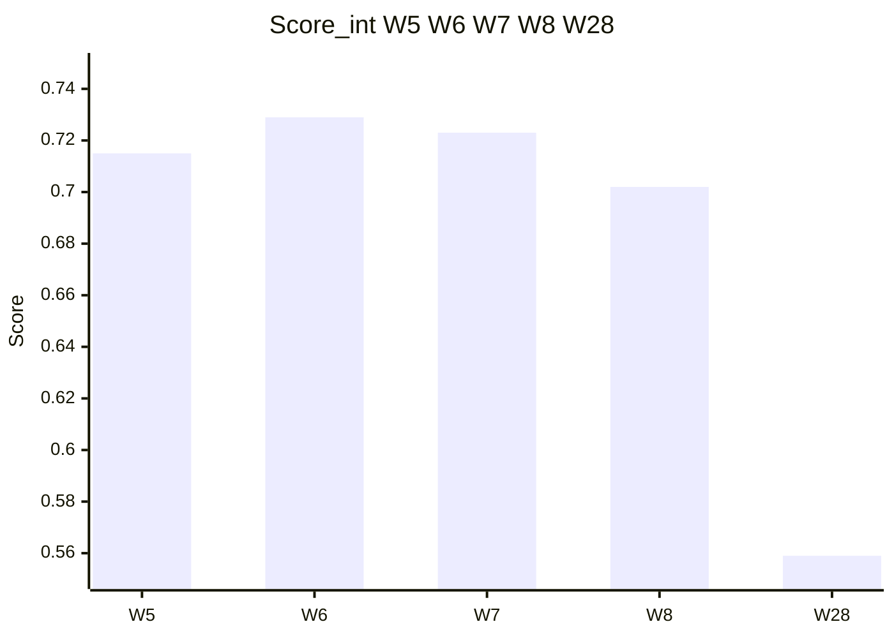
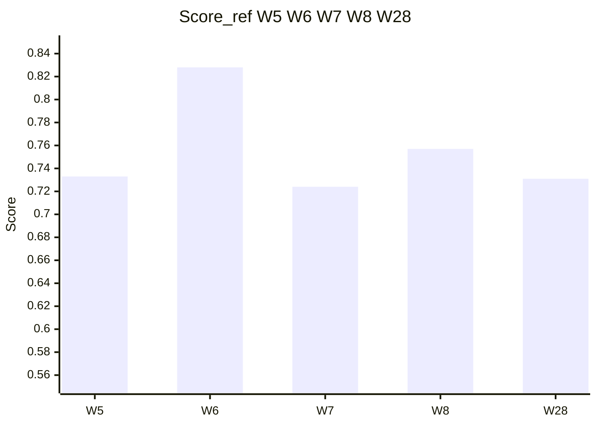

# Weight crossover (Score vs alpha)

Reuses numbers from [weight-sensitivity.md](../03-search/weight-sensitivity.md). No new formulas.

Define \(L(W) = 0.5M + 0.5Q_{\mathrm{prox}}\), \(G(W) = 0.5Y + 0.5D_{\mathrm{norm}}\), and \(\mathrm{Score}(\alpha) = \alpha L + (1-\alpha)G\).

## Top W as alpha shifts (solar to lunar bundle)



Leaders: **W=28** at α=0.00; **W=6** at α=0.25 through 1.00. **W=7** stays below **W=6** on bundled \(L\) in this sweep.

## ASCII

```
alpha   Top W   Score(alpha)   Reading
──────────────────────────────────────────────
0.00    28      0.978          Y + D dominate
0.25    6       0.857          crossover to W=6
0.50    6       0.860
0.75    6       0.864
1.00    6       0.867          pure lunar bundle L
```

Gap **6 vs 7** on Score_int = **0.006** - smaller than typical weight retuning.

## Score_int vs Score_ref (W = 5, 6, 7, 8, 28)

From [integer-weeks.md](../03-search/integer-weeks.md).





## ASCII bars

```
Score_int   W5 .715  W6 .729  W7 .723  W8 .702  W28 .559
Score_ref   W5 .733  W6 .828  W7 .724  W8 .757  W28 .731
```

**W=6** leads both composites here; **W=28** rises under **Score_ref**-style Y+D weighting but not Score_int.

System write-up for W=6: [hex.md](../04-systems/hex.md).
