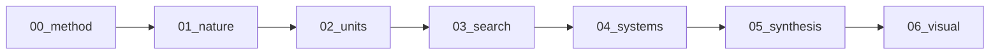
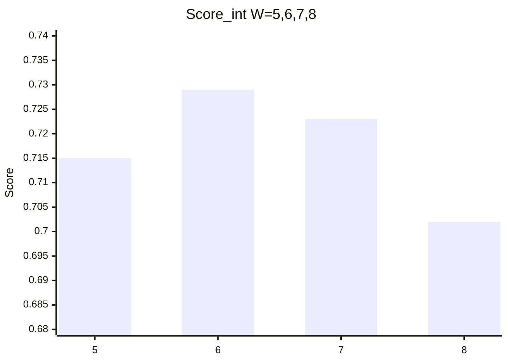

# Epact

**Epact** asks one question: **how many days should a week have?** Candidates include 5, 6, 7, 8, a mix of 7- and 8-day weeks, a phase-tied quarter of about 7.38 days, or no named week at all. The evidence is astronomy, tides, and biology - not calendar history.

> [!IMPORTANT]
> A mean **lunar quarter** is **7.382647…** solar days. That is not an integer, so any whole-day week is an approximation. **Epact** is the name we use for the leftover when a week grid and the Moon (or the year) do not line up.

## Rules of the project

- **Evidence:** astronomy, tides, biology, number theory.
- **Not evidence:** "we have always used seven days."
- **Outcome:** scored options (W = 1…30), the **Metonic 7/8 week grid**, and five example calendars.

Key result: [03-search/metonic-week-grid.md](03-search/metonic-week-grid.md)

Charts: [06-visual/](06-visual/) · [week scores](06-visual/week-composite-scores.md)

## Reading order

| Path | Contents |
|------|----------|
| [glossary.md](glossary.md) | Terms |
| [00-method/](00-method/) | Axioms, constants, impossibility, scoring |
| [01-nature/](01-nature/) | Cycles and biology |
| [02-units/](02-units/) | Day, rest, week, month, year as separate choices |
| [03-search/](03-search/) | Week scores, 7/8 mix, Metonic grid, intercalation |
| [04-systems/](04-systems/) | Lune, Mix, Binary, Solar5, Dual |
| [05-synthesis/](05-synthesis/) | Comparison and open questions |
| [06-visual/](06-visual/) | Charts for the week search |

**Quick visuals:** [month closure](06-visual/month-closure.md) · [pick a system](06-visual/choose-a-system.md)

## Top integer week scores (preview)

| W | Score_int | Hint |
|---|-----------|------|
| 6 | 0.729 | Leads default rank; Y=0.874 |
| 7 | 0.723 | Best lunar quarter proximity |
| 5 | 0.715 | Strong Y; Solar5 |
| 8 | 0.702 | Binary scheduling |

Start with [00-method/impossibility.md](00-method/impossibility.md). Full table: [03-search/integer-weeks.md](03-search/integer-weeks.md).
